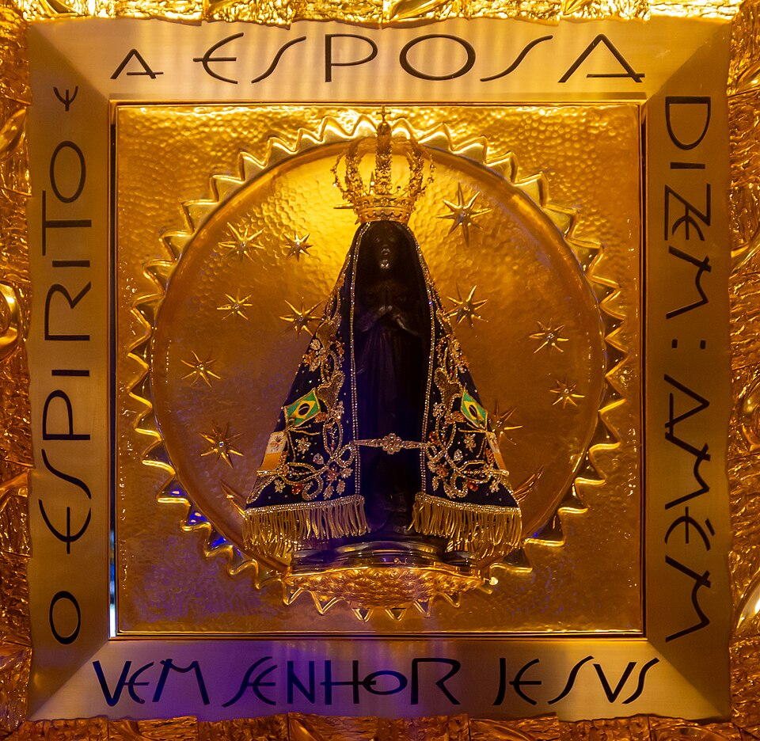

# Nossa Senhora Aparecida, 12 de outubro

Desde sempre o povo brasileiro teve uma grande devoção a Nossa Senhora, sobretudo sob o título da Imaculada Conceição. Nossa Senhora da Conceição Aparecida é a padroeira principal do Brasil desde 1930. Em 1717 pescadores encontraram no rio Paraíba, no município de Guaratinguetá, no Estado de São Paulo, uma imagem de Nossa Senhora da Conceição que passou a ser designada de Nossa Senhora Aparecida. Hoje há uma majestosa basílica às margens da Via Dutra, entre o Rio de Janeiro e São Paulo. Para lá acorrem milhares e milhares de peregrinos de todas as partes do país a cada fim de semana. Vão pagar promessas, fazer pedidos e render graças aos benefícios obtidos por intercessão da Virgem Aparecida. O mais importante é que os fiéis devotos de Maria sustentem seus pedidos constantes de conversão do coração e que procurem ter um interior semelhante ao de seu Filho, Jesus. Maria quer que nos acheguemos a ela e, então, ela se encarrega de nos levar a Jesus. Ela é aquela que encontrou graça diante de Deus e pode interceder pelos homens que foram resgatados por seu divino Filho.

A imagem de Nossa Senhora Aparecida foi encontrada em outubro de 1717 pelos pescadores Domingos Garcia, João Alves e Felipe Pedroso.
