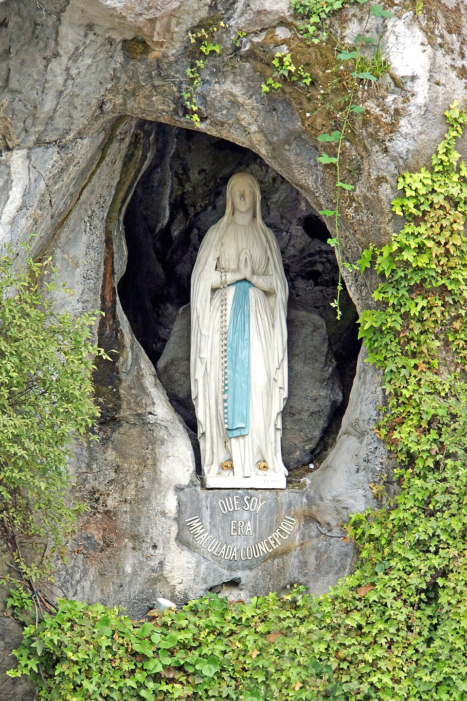

# Nossa Senhora de Lourdes, 11 de fevereiro

Cercada pelas montanhas dos Pireneus, a cidadezinha de Lourdes é ponto obrigatório de todos os devotos de Maria que vão à França ou à Europa. Perto de um riacho, uma menina chamada Bernadette teve uma experiência única com a Mãe de Jesus, que se declarava como Imaculada Conceição. Maria pedia conversão e oração numa época de profunda descristianização. Desde 1858 Lourdes passou a ser uma terra santa. Para lá convergem incontáveis peregrinações. Há congressos e encontros religiosos realizados em modernas e amplas instalações. Sobretudo, Lourdes é procurada por pessoas que têm doenças no corpo e que vivem problemas no coração. É impressionante ver a confiança dos enfermos, sua fé e piedade, no momento em que passa a procissão eucarística. E sabe-se que lá se operam prodígios e milagres feitos pela mão de Deus através de Maria. A grande missão de Maria é interceder junto a seu Filho pela conversão dos pecadores e homens, para que todos sejam dela. Que os devotos de Nossa Senhora de Lourdes trabalhem sempre em sua conversão pessoal.
