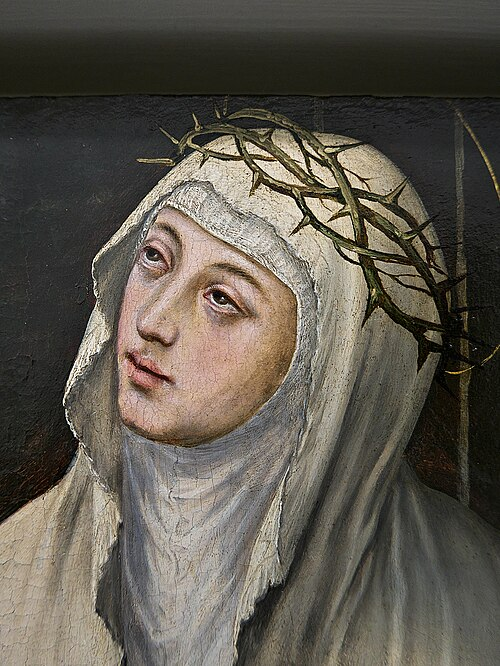

# Santa Catarina de Sena, 29 de abril

Catarina nasceu em Sena, Itália, em 1347. Já aos seis anos teve a primeira experiência mística, que seria sua característica em toda a vida, tornando-a uma personalidade realmente empolgante. Tais experiências ela as registrou no Diálogo, obra de valor até nossos dias. Viveu em pleno século XIV como terceira dominicana.

Paz era seu lema para a cidade conturbada de Sena, mas sobretudo para a Igreja, vivendo uma das mais conturbadas fases, com o papado transladado para Avinhão, na França. Escreveu cartas veementes, católicas e violentas a todos os responsáveis, gritando: "Reforma!" Por sua ação, o papa regressou a Roma e ela foi também até lá para de perto combater as indecisões, e ali morreu, em 1380.

Em 1970 é declarada doutora, sendo com Santa Teresa d'Ávila a primeira mulher a um papel dentro da estrutura eclesiástica e pela firmeza em conduzir a reforma da Igreja.
