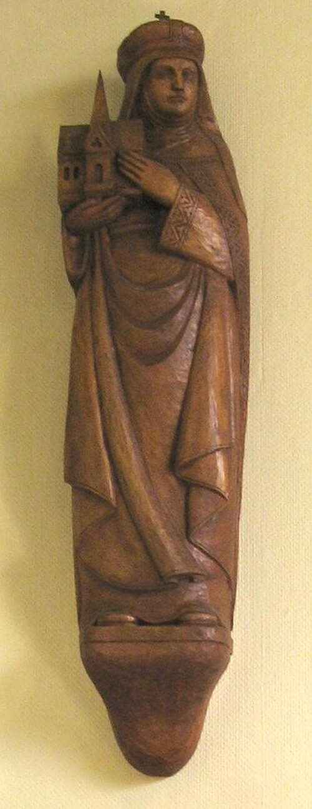

# Santa Hedviges, 16 de outubro

### Esposa, viúva e freira

Hedviges nasceu, na Baviera, de família nobre, em 1174. Já aos 12 anos foi dada em matrimônio ao duque da Silésia e Polônia. Depois de seis filhos fizeram o voto de castidade. Muito sofreu porque perdeu vários filhos ainda crianças, viu o esposo preso e o perdeu pouco depois. Dedicou-se ao bem de seus súditos com obras de caridade e dedicou-se à construção de mosteiros, entre eles o de Trebnitz, onde entrou uma sua filha e, mais tarde, ela mesma.

Depois de viúva, entrou no convento, mas ainda ali sofreu, pois seu filho mais velho, o duque Henrique II, morreu na cruzada contra os turcos. Depois de sofrer e praticar o bem, faleceu em 1243. Era tia de Santa Isabel da Hungria.

Ela que viveu momentos angustiosos e os soube suportar com fé profunda, é largamente invocada, hoje, para os casos difíceis sobretudo no setor das dívidas. Mas antes de tudo aparece como mulher que passou vários estágios da vocação cristã, vividos todos eles na confiança e na paciência...

### Oração à Santa Edwiges

Vós, Santa Edwiges, que fostes na terra amparo dos pobres e desvalidos e socorro dos endividados, no céu, onde gozais o eterno prêmio da caridade que praticastes, confiante vo-lo peço, sede a minha advogada para que de Deus eu obtenha a graça de que necessito, e por fim a graça suprema da salvação eterna. Amém.
