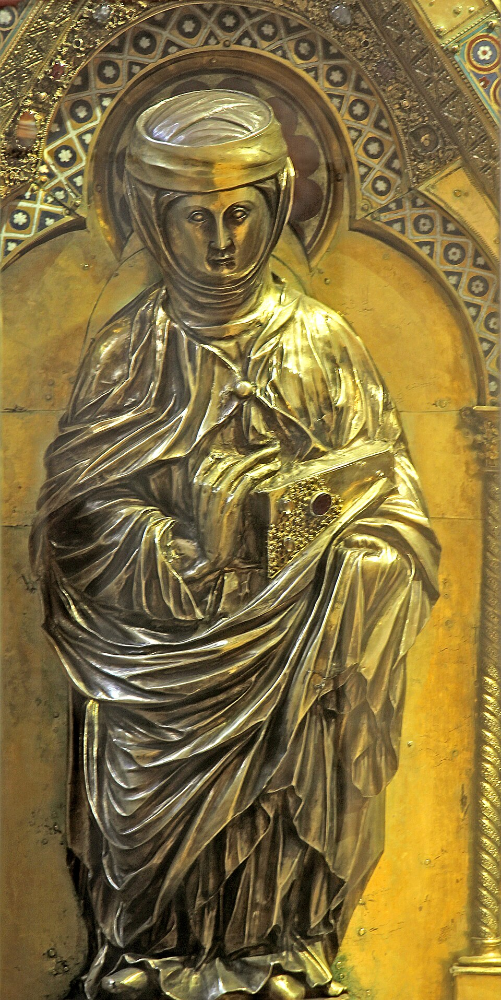

# Santa Isabel da Hungria, 17 de novembro

Isabel nasceu na Hungria em 1207. Aos 14 anos desposou Luís IV da Turíngia. Isabel tinha um temperamento ardoroso e a vida em comum com o esposo lhe deu grande equilíbrio. Nesta época brilhava uma claridade na Igreja: São Francisco de Assis. Queria viver no lar o ideal da vida evangélica proposta por Francisco. Em 1227 seu marido deveria partir numa cruzada e três meses depois morreu na Itália. Neste momento Isabel esperava seu terceiro filho.

Teve um diretor espiritual que a atemorizava. Não queria a vida da corte. Rompeu com sua família e se revestiu do hábito da Ordem Terceira Franciscana para se entregar aos cuidados dos pobres e dos doentes, nos quais via o próprio Cristo. Morreu muito jovem, com apenas 24 anos. Sua saúde não resistiu a muitas penitências e austeridades a que se entregava. Isabel é tida como uma das padroeiras das obras de misericórdia.
