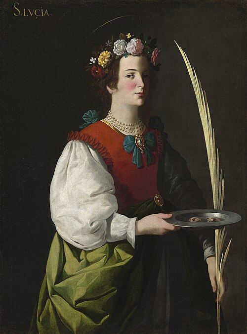

# Santa Luzia, 13 de dezembro

### A padroeira da visão

Pouco sabemos de sua vida. Deu testemunho da fé, morrendo em Siracusa, nos inícios do século IV. De lá seu culto passou a Roma e foi venerada como uma das corajosas mulheres que deram a vida por Cristo. A lenda acrescentou muitos dados a esta personagem, sobretudo o motivo que a tornou a padroeira dos olhos e que a arte habituou-se a representá-la segurando seus olhos dentro de uma bandeja. O prefeito de Siracusa, Pascásio, que a mantinha presa, apaixonou-se por sua beleza e empregou todos os meios para obter-lhe a mão. Luzia, para escapar deste convite, teria arrancado os próprios olhos. Apesar disso, foi submetida a terríveis tormentos, mas a tudo resistiu bravamente, nesse caminho doloroso. Por este fato é ela invocada como protetora contra as doenças dos olhos.

Seu nome, aliás, tem como raiz a palavra latina que significa luz. Não só ajuda, pois, a vista física, mas também a visão interior, para que vejamos o Senhor em tudo e em todos.
