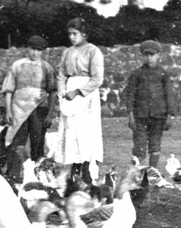

# Santa Maria Goretti, 6 de julho

Santa Maria Goretti nasceu aos 16 de outubro de 1890, em Ferriere di Conca, filha de camponeses pobres, o que a fez ocupar-se, desde cedo, com os irmãozinhos menores. Sua bondade, delicadeza, aplicação, modéstia, docilidade e piedade faziam-na ser chamada de Anjo. Crescia bonita e atraente. Um vizinho a observava, de modo singular, e arquitetava planos sinistros a respeito dela: era Alexandre Serenelli. Quando ela se recusou a satisfazer-lhe os instintos, ele a feriu a golpes de estilete, no dia 5 de julho de 1902. Morreu no dia seguinte, 6 de julho, vítima dos apetites desmedidos de um homem, para salvar sua pureza e inocência. Pio XII a canonizou no dia 24 de junho de 1950. A camponesa virgem, pobre e mártir, subia à glória dos altares e tornava-se o exemplo vivo para uma juventude envolvida pelas ilusões e pressões de um século corrupto. "Lírio vestido de púrpura", chamou-a Pio XII, "a doce e pequena mártir da pureza."
