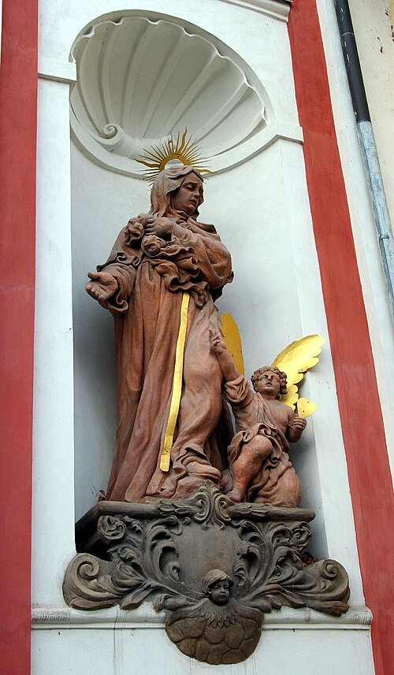

# Santa Mônica, 27 de agosto

Mônica nasceu em 332 no seio de uma família cristã da África romana (atual Argélia). Saindo da adolescência, seus pais a casaram com um pagão chamado Patrício, bastante mais velho do que ela. Mônica soube ganhar sua afeição e levá-lo à fé cristã. O marido recebeu o batismo antes de morrer. Teve quatro filhos. É conhecido o amor desta mãe por seu filho Agostinho, que seria depois um grande bispo da Igreja da África. No momento em que este filho abandonou a fé cristã de sua infância, as lágrimas da mãe subiram ao céu como uma oração silenciosa e perseverante. Santo Ambrósio dizia a Mônica: "Um filho de tantas lágrimas certamente não há de se perder." A conversão de Agostinho encheu de alegria o coração de Mônica. A oração da festa da santa se dirige a Deus como Aquele que é reconforto dos que choram e que acolheu com amor as lágrimas de Santa Mônica pela conversão de Santo Agostinho. Que os cristãos saibam também chorar de arrependimento por seus pecados. As lágrimas das mães têm muita força. Elas penetram os céus e atingem o coração de Deus.
