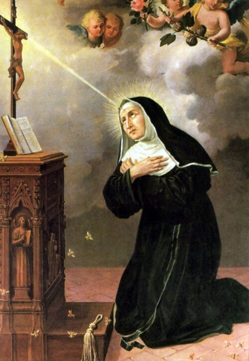

# Santa Rita de Cássia, 22 de maio

### Esposa, mãe e religiosa

Nasceu Rita, em 1381, perto de Cássia, nas terras da Úmbria, Itália. Escolheu a vida de casada, mas o marido foi um verdadeiro tirano: aventureiro e mulherengo, violento em casa e grosseiro no trato. Sua paciência, oração e bondade acabaram por domar a fera, mas foi assassinado. Ficaram dois filhos que herdaram os traços fundamentais do pai.

Propuseram-se vingar o pai. Mas Rita pedia a Deus antes mortos que assassinos. E os dois morreram cedo. Resolveu fazer-se religiosa. Com dificuldades, ingressou no convento das irmãs agostinianas, onde levou uma vida de profunda espiritualidade e caridade até a morte, em 1457, aos 76 anos.

Foi canonizada em 1900 e goza de grande prestígio entre os fiéis como padroeira dos casos desesperados, que estiveram tão presentes na sua vida. Coloca-se como exemplo de mãe e esposa porque, mesmo entre tormentos e desprezo, soube santificar-se e guardar a fé e as energias para consumá-las por Deus na vida consagrada.

### Oração em honra de Santa Rita

Ó Deus poderoso e fiel, distinguistes a vossa grande serva, Santa Rita, com muitas graças e favores. Fizestes dela exemplo de mãe dedicada ao lar, de esposa compreensiva e de religiosa exemplar. Concedei pela sua intercessão que compreendamos os vossos caminhos e cheguemos à realização plena e perfeita da vossa vontade. Amém.
