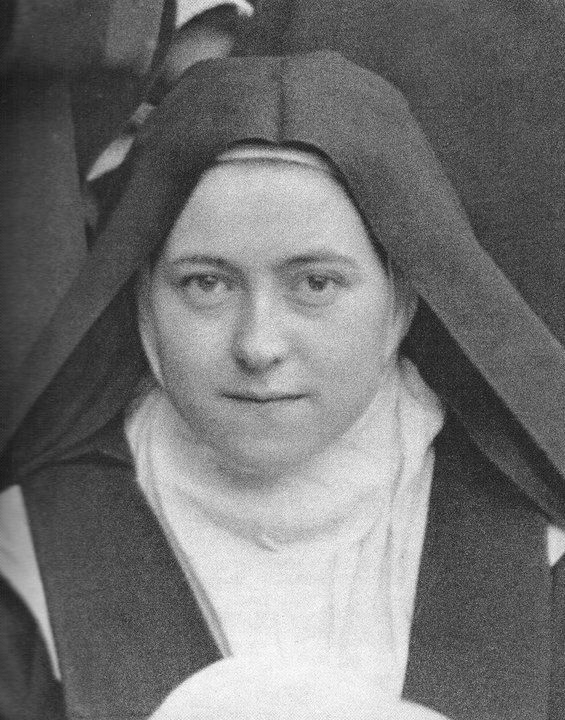

# Santa Teresinha do Menino Jesus, 1 de outubro

Teresinha nasceu em Alençon, França, em 1873. Aos quatro anos perdeu a mãe, sendo educada por uma tia em Lisieux. Aos 15 anos obteve do papa Leão XIII a permissão de entrar no Carmelo de Lisieux, onde viveu 8 anos, tendo recebido o hábito carmelita aos 16 anos. Faleceu em 1897, após ter enfrentado pacientemente a tuberculose e também uma dura provação espiritual. Em sua autobiografia, com o título História de uma alma, podemos ver que foi uma exemplar monja e claustrada. Sua característica principal é a espiritualidade. Teresinha nos diz: compreendi que o amor encerra todas as vocações, e que o amor é tudo; o amor é eterno... encontrei minha vocação: o amor. Com estas palavras, regadas por uma vida de oração, de sacrifícios, de provações, de penitência e de imolação, Teresinha nos ensina que o amor é o dom maior. Suportou todas as provações e morreu dizendo: "Oh! eu te amo. Meu Deus, eu te amo."

### Oração a Santa Teresinha do Menino Jesus

Ó Santa Teresinha, sois exemplo de simplicidade e de humildade e sempre vos colocastes nas mãos do Pai. Intercedei junto a Deus para que os homens compreendam o vosso caminho, que leva ao Céu, para que, vencendo o egoísmo e o orgulho, possam construir um mundo melhor e conquistem os povos para o Reino de Cristo pelo amor, justiça e paz. Fazei com que os homens compreendam a mensagem do Evangelho e sejam atraídos a viverem o ideal cristão do amor pelo espírito de desapego e doação. Santa Teresinha do Menino Jesus, padroeira das missões, rogai por nós e protegei os missionários. Amém.
