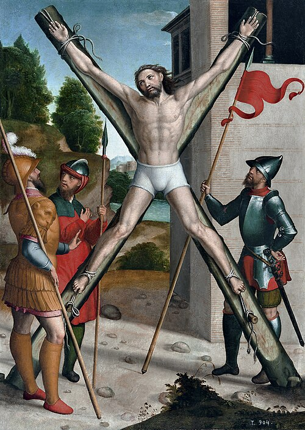

# Santo André, 30 de novembro

Santo André é um dos doze discípulos de Jesus. A liturgia grega o considera "protocleto", ou seja, o primeiro mencionado nos Evangelhos. Sabe-se que morreu na cruz em forma de X. No Novo Testamento é pouco mencionado e consta que era irmão de Simão Pedro. Antes de conhecer Jesus, já era discípulo de João Batista. Junto com Simão Pedro abandonou a barca e seguiu a Jesus. O desejo da morte de cruz de Santo André não se tratava apenas de imitar o Cristo. A morte de cruz era uma consequência por ter assumido a Boa Nova de Jesus. Como Jesus Cristo, lutou contra o sofrimento e procurou aliviar o peso das cruzes. A sua morte na cruz é resultado de uma vida vivida em favor da vida dos que tinham pouca esperança de vida, isto é, dos pobres, oprimidos e marginalizados da sociedade. Não foi por ter morrido na cruz, o ato em si, que o fez servo de Deus, mas por sua opção de vida.
