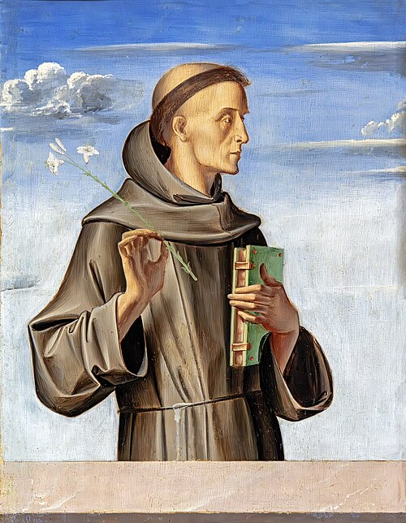

# Santo Antônio, 13 de junho

Este que o mundo inteiro venera como Santo Antônio de Pádua, na realidade nasceu em Lisboa, em 1195, e recebeu na pia batismal o nome de Fernando. Muito jovem entrou para a Ordem dos Eremitas de Santo Agostinho e recebeu lá o sacerdócio. Ficou profundamente impressionado com o martírio sofrido pelos frades menores no Marrocos. Pediu também para ser recebido na família franciscana. Torna-se então frei Antônio e em 1221 já o vemos ao lado de Francisco de Assis no Capítulo Geral. Revelou então suas qualidades de pregador. Seus superiores o enviaram ao norte da Itália e ao sul da França. Grassava lá a heresia dos cátaros. Provocou, com suas pregações, um vasto movimento de conversões. Ao voltar para a Itália, pregou muito contra os mais ricos. Exortava seus ouvintes a se desfazerem de seus bens em favor dos pobres. Somente em 1230 se instalou em Pádua. No ano seguinte, depois de ter pregado durante uma quaresma e de ter movimentado a cidade toda, morreu com a idade de 36 anos e foi canonizado a 30 de maio de 1232, pouco tempo após sua morte.

### Oração em honra de Santo Antônio

Ó Deus eterno e todo-poderoso, destes Santo Antônio ao vosso povo como grande pregador e intercessor em todas as necessidades. Fazei-nos por seu auxílio seguir os ensinamentos da vida cristã e sentir a vossa ajuda em todas as provações. Assim seja.
