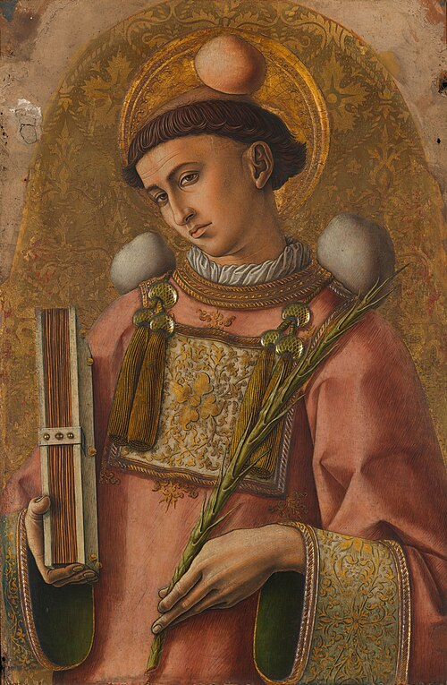

# Santo Estêvão, 26 de dezembro

Duas solenidades durante o Ano litúrgico têm oitava, isto é, são celebradas durante oito dias: a Páscoa e o Natal. A oitava da Páscoa é privilegiada, isto é, exclui outras festas. A do Natal não. É celebrada junto com outras festas. A primeira delas é a de Santo Estêvão, primeiro mártir. O dia da morte dos santos é chamado pela tradição cristã de dia natalício, ou seja, dia do nascimento para Deus. É este nascimento para Deus que realmente importa. A morte do cristão será realmente nascimento para Deus, na medida em que, a exemplo de Santo Estêvão, sua vida tiver sido um testemunho de Cristo. Assim sendo, ele receberá a coroa da vida. A palavra Estêvão significa coroa. A coroa é símbolo de vitória, de triunfo e de recompensa. Santo Estêvão recebeu de Cristo a coroa do martírio, isto é, a recompensa da vida eterna, a participação de sua glória. Esta recompensa nos é reservada se soubermos dar testemunho de Cristo nesta vida.
