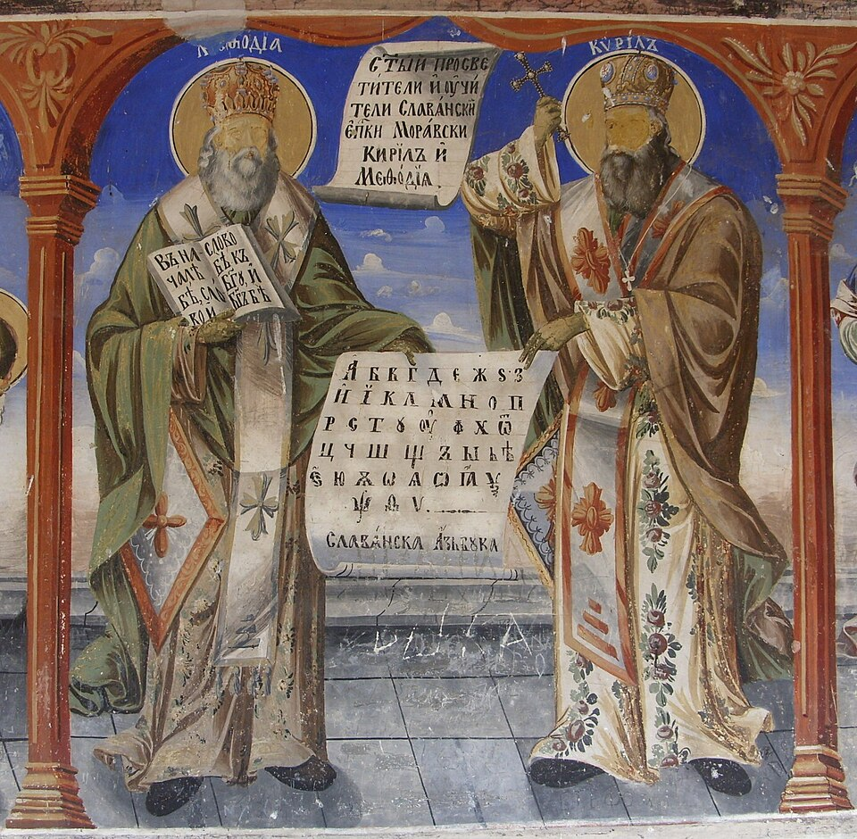

# Santos Cirilo e Metódio, 14 de fevereiro

### Apóstolos dos eslavos

Metódio, o mais velho dos dois, nasceu entre 815 e 820, e Cirilo, entre 827 e 828, filhos de um alto funcionário imperial, em Tessalônica, parte do Império Romano. Metódio abandonou a carreira política e recolheu-se a um mosteiro, em 840, enquanto Cirilo fez-se sacerdote em Bizâncio. Deixando os cargos eclesiásticos que estava exercendo, retirou-se também a um mosteiro.

Foram escolhidos para missionar a Morávia, vasta região de diversas populações eslavas, na Europa Central, onde consagraram toda uma vida entre viagens, privações, sofrimentos, adversidades e perseguições, até o sangue. Suportaram tudo com fé inabalável e esperança irrenunciável em Deus. Cirilo faleceu em 869 e Metódio, como bispo, em 885.

João Paulo II os proclamou copadroeiros da Europa, em 1980, e em 1985 escreveu uma encíclica sobre eles, porque permaneceram ligados na memória da Igreja à grande obra da evangelização que realizaram.
