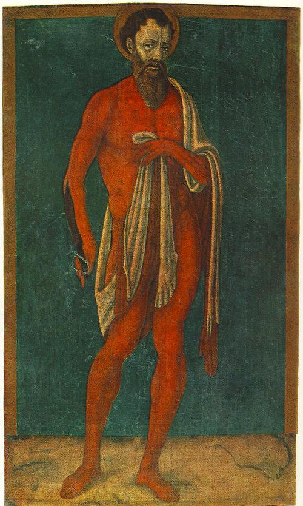

# São Bartolomeu, 24 de agosto

### O apóstolo sem fingimento

Os Evangelhos de Marcos, Mateus e Lucas mencionam Bartolomeu entre os apóstolos de Jesus. São João lhe dá outro nome: Natanael. Seu amigo Filipe havia-lhe falado sobre Jesus de Nazaré e ele, antes mesmo de conhecer Jesus, disse com menosprezo: "De Nazaré pode sair algo que preste?" Jesus depois lhe devolve a crítica com um elogio: "Eis aí um israelita sincero, em quem não há fingimento!" Natanael entendeu a indireta. Tornou-se apóstolo ardoroso, que após a morte e ressurreição de Jesus foi pregar o evangelho em outras terras, especialmente na Pérsia e no Egito. Contam os relatos antigos que ele foi esfolado vivo, pela fé.

Será que a gente, mesmo fazendo aqui e ali as nossas críticas, somos capazes de nos comprometer com a comunidade da Igreja e "dar até a nossa pele" para que o Evangelho seja conhecido e vivido?
