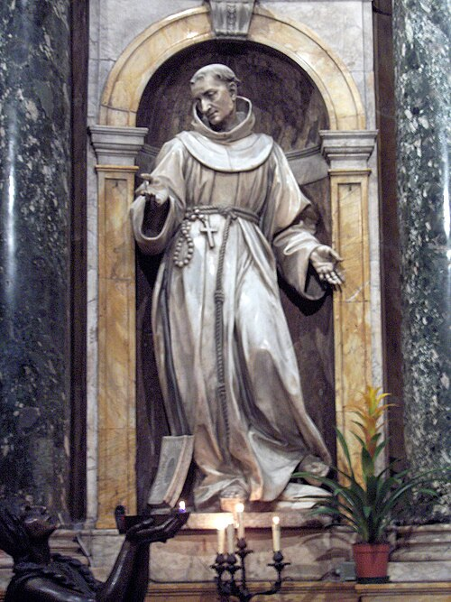

# São Bernardino de Sena, 20 de maio

Nasceu na região de Sena, na Toscana, Itália, em 1380. Órfão de pai e mãe, foi morar com tios que lhe inculcaram profunda piedade, sobretudo uma forte devoção a Nossa Senhora. Aos 22 anos recebeu o hábito dos franciscanos e foi ordenado sacerdote em 1404. Havia, naquela época, entre os franciscanos, um grupo de frades que queria uma vida bem austera em pequenos conventos, e Bernardino tornou-se líder e animador desse movimento por um maior rigor. Em 1418 começou uma prolongada atividade de pregações, que deveria durar por mais de 20 anos. Tinha um ardente amor pelo nome de Jesus e por toda parte levava essa devoção. São Bernardino só deixou de pregar ao povo quando ficou muito doente. Veio a falecer a 20 de maio de 1444. A admiração e o respeito que essa figura suscitou entre seus contemporâneos fez com que já seis anos após sua morte fosse declarado santo. Morreu no convento de Áquila, sendo venerado grandemente hoje, sobretudo na Itália. Sua festa é a 20 de maio.
