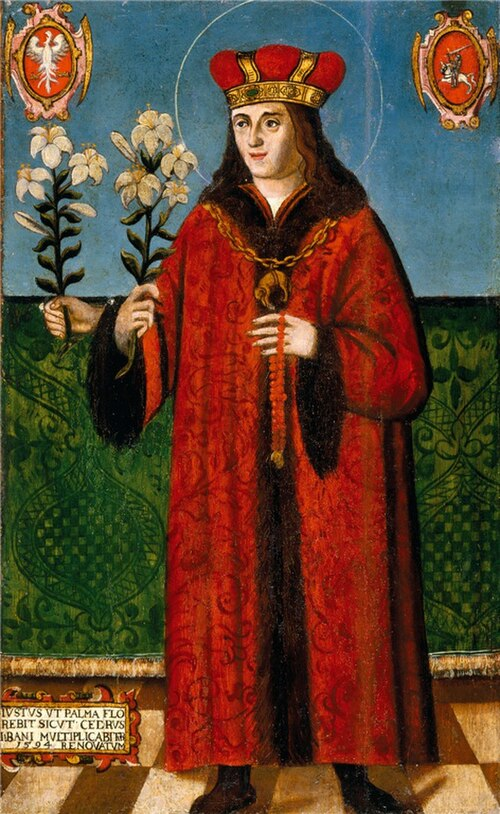

# São Casimiro, 4 de março

Casimiro morreu aos 25 anos de idade, sendo declarado santo 38 anos depois de sua morte, e é padroeiro da Polônia. Nasceu em 1458 e era filho do rei da Polônia e neto do rei da Hungria. Foi orientado em sua juventude por um cônego da Cracóvia, que viria a se tornar bispo da mesma cidade. A rainha-mãe tinha muito empenho em que seu filho tivesse boa formação religiosa. Fez muitas penitências em sua tenra idade e talvez isso tenha prejudicado sua saúde. Muito jovem ainda viu-se envolvido na política de sua época. Teve amarga experiência ao querer ocupar o trono que os húngaros lhe tinham oferecido como legítimo sucessor. Associado ao pai nos negócios do governo da Polônia, não aceitou os arranjos que este fez para que Casimiro casasse com uma filha do imperador da Alemanha. Viajava para a Lituânia quando se manifestou violentamente a tuberculose, de que veio a falecer em 1484. Sua festa é comemorada a 4 de março.
