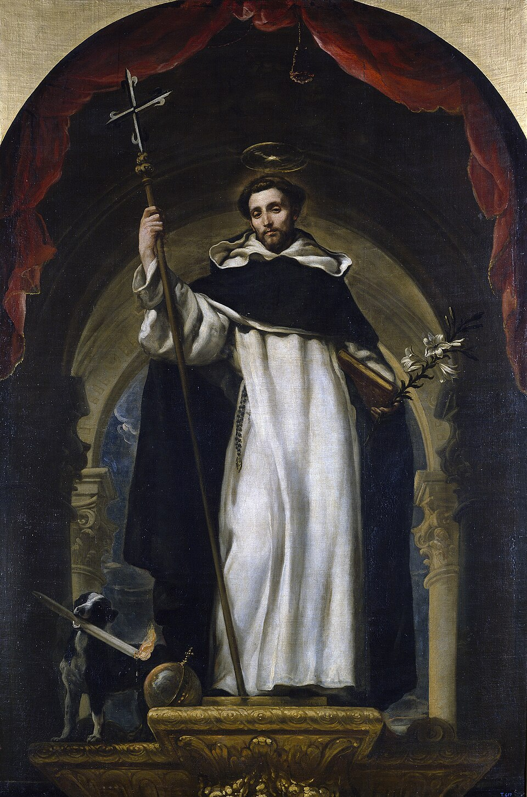

# São Domingos, 8 de agosto

Nasceu na Espanha em 1170. Conta-nos a tradição que, antes de Domingos nascer, sua mãe previra num sonho que seria uma luz extraordinária de caridade e zelo apostólicos. Recebeu educação junto a um tio, reitor de uma igreja, aprendendo os serviços da igreja. Foi a Valência para estudar filosofia e teologia. Aos 30 anos, foi ordenado sacerdote pelo bispo de Osma. Viajando com este bispo, conheceu os problemas da Igreja, causados por grupos hereges e subversivos. Fundou a Ordem dos Pregadores, ou dominicanos. Encontrou-se com São Francisco em Roma quando foi pedir a aprovação de sua Regra, tornando-se amigo dele. São Domingos dedicava-se às práticas de piedade e rígidas penitências. Com espírito evangélico visitava os pobres, doentes, órfãos e viúvas. Na simplicidade e pobreza dedicou-se aos ensinamentos da doutrina cristã, sendo fermento de transformação, deixando-nos um exemplo de luta em favor da fé cristã.
