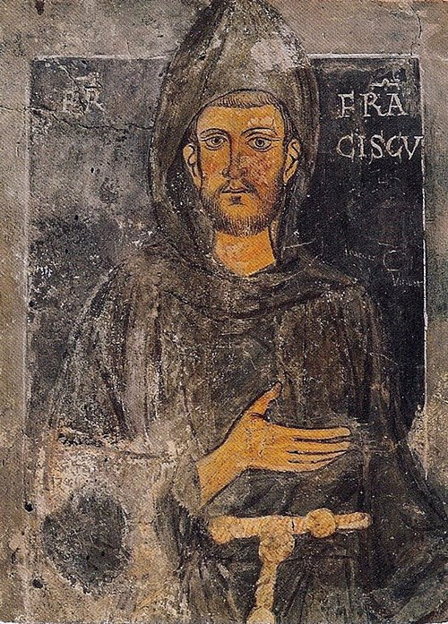

# São Francisco de Assis, 4 de outubro

São Francisco é conhecido como o santo pobre, o poverello de Assis. Qual a razão de uma vida dedicada aos privados das condições essenciais de vida e subtraídos de sua dignidade humana? Uma vez decidido a viver plenamente o Evangelho, Francisco descobre no pobre a figura do Cristo pobre e humilhado. O Cristo do Evangelho dirige-se preferencialmente aos pobres por se abrirem à sua mensagem. Fazendo-se pobre, Francisco terá um coração livre para acolher o Evangelho como proposta de vida. Além do mais, os pobres fazem-no perceber que para seguir a Jesus é preciso desfazer-se do homem corrompido pelas ilusões da fama e do poder. São Francisco não pertence à Igreja nem à Ordem dos Frades Menores, mas aos pobres, àqueles que buscam nele a inspiração para a construção de um mundo de irmãos. Ajudou a Igreja a reencontrar suas raízes evangélicas e, por seus filhos, deu uma nova escola de filosofia e teologia. Sem dúvida é o santo mais conhecido e mais amado da Igreja.

### Oração em honra de São Francisco de Assis

Ó Deus, fizestes São Francisco assemelhar-se ao Cristo por uma vida de humildade e pobreza. Concedei-nos que, seguindo fielmente o vosso Filho, trilhemos o mesmo caminho de São Francisco. Unidos com ele na perfeita alegria de ser discípulo, filho e testemunha de Jesus Cristo em nossa vida, cheguemos à bem-aventurança. Amém.
