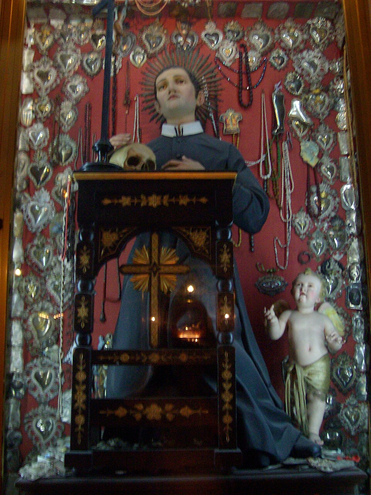

# São Geraldo Magela, 16 de outubro

Um dia, o superior de uma missão redentorista enviou um candidato a irmão leigo ao noviciado, mandando junto um bilhete: "Envio-lhe um candidato, do qual eu não pude me livrar. Insistiu tanto em acompanhar-nos. Saímos às escondidas dele. Mas, um mês ao caminho de volta, ele nos alcançou e pediu com tanta insistência, que eu não pude me livrar dele. Veja o que pode fazer dele." Este candidato era o jovem Geraldo Magela, da cidade de Muro, na Itália, nascido a 6 de abril de 1726. Quando percebeu que os missionários tinham ido embora sem avisá-lo, tentou sair do quarto, onde passara a noite. Mas encontrou a porta fechada por fora, providência tomada pela mãe dele, a conselho dos missionários. Geraldo então fez como que uma corda com os lençóis, saiu pela janela do 2º andar da casa.

Distinguiu-se em todas as virtudes, principalmente a obediência e simplicidade. Amava muito os pobres. Certa vez, distribuindo sopa aos pobres na porta do convento, a sopa não se esgotou até que o último, entre a multidão de pobres, recebesse sua porção. A vida de Geraldo foi uma constante de fatos prodigiosos e milagrosos desde a infância até à morte. Morreu santamente no dia 16 de outubro de 1755, com apenas 29 anos de idade.

### Oração

Ó Deus, que quisestes desde a sua mais tenra idade chamar a vós São Geraldo e fazer dele uma viva imagem do vosso Filho crucificado, fazei, Senhor, que nós, seguindo seus exemplos, sejamos transformados neste mesmo divino modelo. Por Jesus Cristo, nosso Senhor. Amém.
