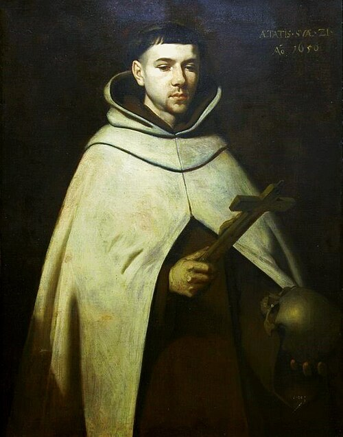

# São João da Cruz, 14 de dezembro

Juan Yepes foi seu nome de batismo. Nasceu na Espanha em 1542. Com 21 anos ingressou na Ordem Carmelita. Em 1567 celebrou a primeira missa em Medina, onde estava sua mãe. Entusiasmado por Teresa de Ávila, iniciou um trabalho de reforma na Ordem e em 1568 surgiu o primeiro convento carmelita reformado, dando origem aos carmelitas descalços. Por causa da reforma foi preso. Fugindo da prisão continuou sua obra, tendo sofrido com isto um processo de expulsão da ordem pouco antes de sua morte, que ocorreu em 1591. Fez um itinerário de ascensão mística para Deus, tornando-se um grande expoente da mística. Abraçou a Cruz dos sofrimentos e das perseguições. Não buscou sua própria glória, mas o amor e a glória de Deus eram a única força motriz que o motivava a trabalhar e a sofrer. Meditava constantemente na paixão e morte de Jesus Cristo. Devido a seus escritos de alta espiritualidade é tido como doutor místico, além de ter sido o grande reformador da Ordem Carmelita.
