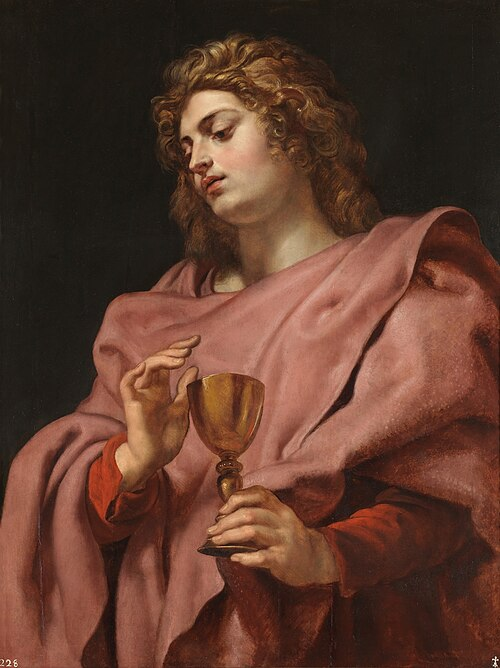

# São João Evangelista, 27 de dezembro

### O apóstolo do amor

São João Evangelista é o santo do Amor. Jesus mostra uma predileção especial por ele. Era o discípulo a quem Jesus amava. Ele escreveu o quarto Evangelho, três cartas e o Apocalipse. Duas coisas caracterizam os seus escritos: a profundidade com que penetrou no tema da revelação de Deus, tanto assim que é chamado de teólogo, que tem como símbolo a águia, pássaro que voa muito alto e é perspicaz; e o tema do amor, que aparece fortemente nos seus escritos, sobretudo nas cartas. É ele quem fala do Novo Mandamento. É ele quem diz: Deus é amor, e quem permanece no amor permanece em Deus e Deus nele. Ele nos ensina que Deus nos amou primeiro. Por isso, nossa vida deve ser uma resposta de amor ao amor de Deus. Filhinhos, dizia ele, amai-vos uns aos outros. Notemos que suas cartas são lidas no tempo de Natal. Sim! Viver no amor de Deus e do próximo é a maneira mais eficaz de fazer com que seja Natal, com que Cristo nasça na vida dos homens.
