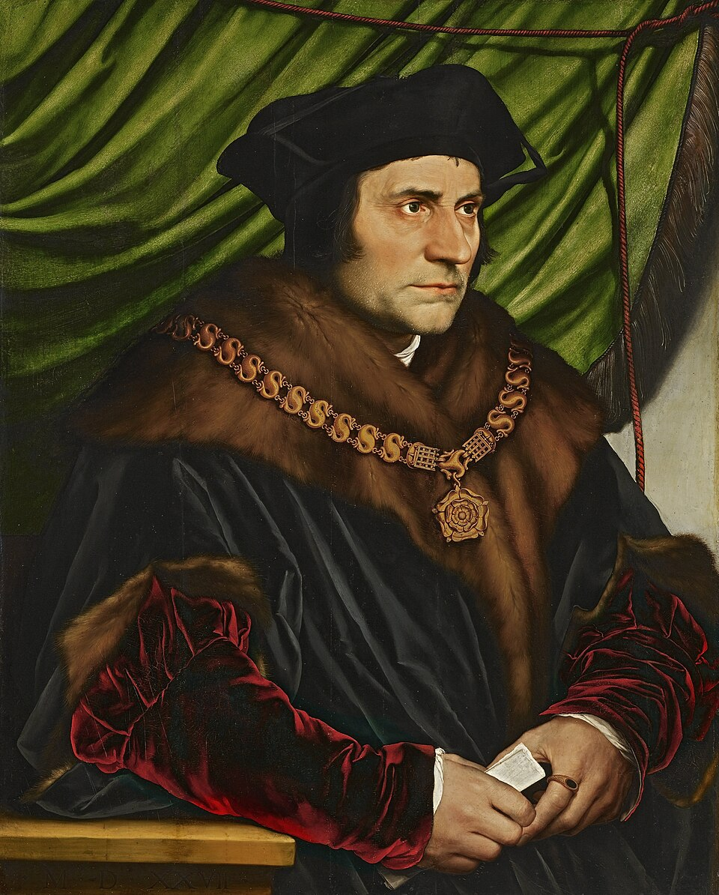

# São João Fisher e Santo Tomás More, 22 de junho

São João Fisher, bispo de Rochester, e Santo Moro (ou More), leigo, foram decapitados por ordem do rei da Inglaterra, Henrique VIII, em 1535. O bispo Fisher, mesmo na prisão, foi nomeado cardeal pelo papa Paulo III. A morte desses dois santos está ligada à tentativa de Henrique VIII de desfazer seu casamento com Catarina de Aragão para unir-se em novo matrimônio com Ana Bolena. O rei, apesar de muita oposição, acabou se casando com Ana, dama de sua corte, contrariando as determinações da Igreja. E fez com que o parlamento inglês proclamasse o rei e seus sucessores como chefes temporais da igreja da Inglaterra. Tomás, homem muito erudito, era conhecido na Europa pelo seu livro Utopia, no qual traçava as linhas de um Estado ideal. Tinha aceito um cargo de lorde chanceler na corte da Inglaterra com a esperança de exercer influência sobre o monarca. Ele e o bispo Fisher foram dos poucos que resistiram à decisão do parlamento inglês, pagando com a vida sua coragem. Foram as primeiras vítimas do cisma anglicano. Sua festa é a 22 de junho.
