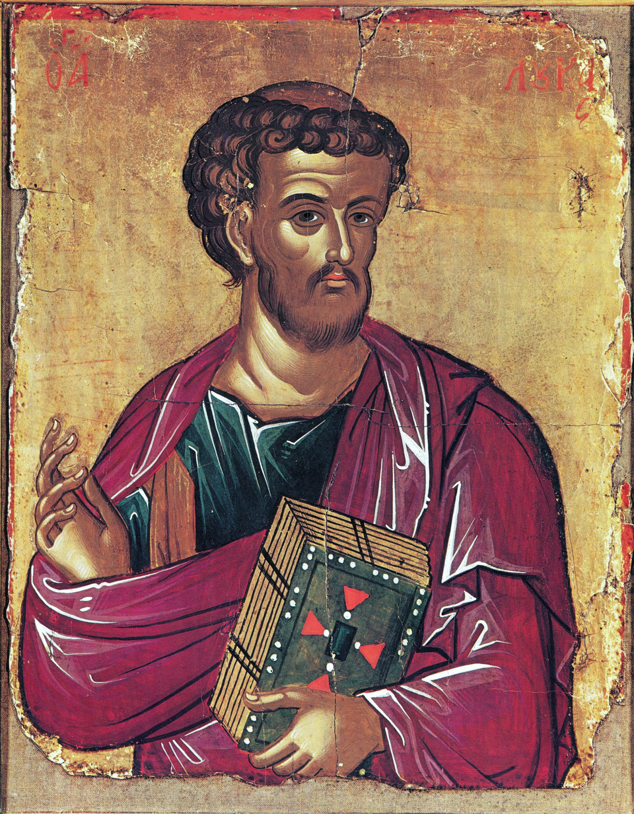

# São Lucas, 18 de outubro

São Lucas, por outro nome Lúcio, era filho de pais pagãos, que habitavam a Antioquia, instruído em muitas línguas e diversas ciências e artes, principalmente na medicina e na pintura. Depois da sua conversão ao cristianismo acompanhou em parte o apóstolo São Paulo, que viajava para anunciar o Evangelho aos povos, e Lucas foi-lhe um companheiro inseparável, um colaborador fiel e zeloso. Escreveu pelos anos 60, debaixo da direção de São Paulo, o seu Evangelho, em que refere muito a miúdo tudo o que está em relação com o sacerdócio de Jesus Cristo; por isso a Igreja lhe conferiu o símbolo do sacrifício, que é um boi, para o distinguir dos outros evangelistas. Alguns anos depois, o mesmo escreveu também os Atos dos Apóstolos. Ficou solteiro para consagrar-se inteiramente ao serviço do Santo Evangelho. Teve a preciosa felicidade de conhecer individualmente a Beatíssima Virgem Maria, e de ouvir da sua boca várias circunstâncias particulares de sua própria vida e de Jesus Cristo seu Filho, e a fim de entender na posteridade a devoção para com a mesma Senhora, pintou o seu retrato, que dizem ser o que se acha em Roma, na Basílica de Santa Maria Maior. Pregou o Santo Evangelho na Itália, França, Dalmácia, Macedônia, e querem os gregos que também no Egito e na Líbia.

Era dotado de suma caridade, paciência, vigilância e de muitas outras virtudes distintas, e levara, segundo a expressão da oração da Igreja, a mortificação da cruz no seu corpo. Não consta com evidência, mas uma lenda muito antiga refere que São Lucas selou com o seu sangue a sua fé em Cristo, sofrendo o martírio em Patras, na Acaia, tendo oitenta e quatro anos, conservando-se sempre virgem, como afirma São Jerônimo. Os seus ossos foram transladados a Constantinopla no ano de 357.

### Oração

Oh! Nosso Deus, queira o vosso santo apóstolo e evangelista Lucas interceder a nosso favor, ele que levava a mortificação da cruz no seu corpo para honrar o vosso nome pelo amor de Jesus Cristo Nosso Senhor. Amém.
