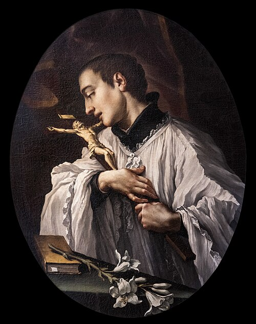

# São Luís Gonzaga, 21 de junho

O padroeiro da juventude católica, São Luís Gonzaga, nasceu a 9 de março de 1568, em Castiglione delle Stiviere, na província de Mântua, Itália, de uma família nobre, com ramificações de parentesco com as cortes da Europa e da família real da Espanha. Sendo o filho mais velho, Luís era o herdeiro principal da família, e o pai sonhava para ele um futuro como valoroso homem de armas. Por conveniências da nobreza da época, Luís foi enviado como pajem nas cortes de Florença, Mântua e Espanha, vivendo em contato com um mundo que, certamente, não era o que sonhava para si, superando visivelmente aquela que foi descrita como uma sociedade da grandeza, da pompa, do veneno e da mais hedionda luxúria. Afirma-se que Luís, mesmo vivendo naquele mundo de vaidades e de pecado, soube manter-se casto, buscando uma elevação constante da mente e do coração em Deus. Para tanto, superando todas as dificuldades, tornou-se religioso em busca de sua santificação.
