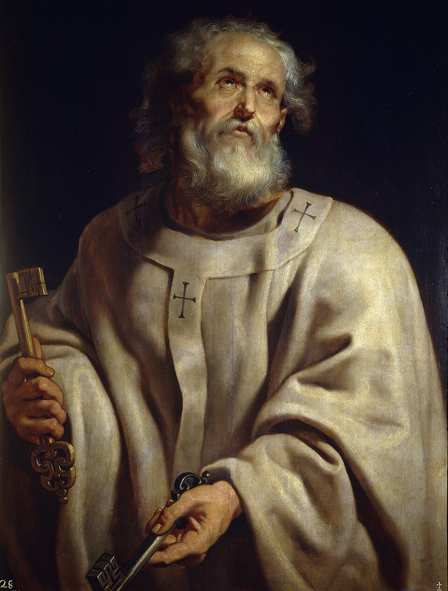

# São Pedro e São Paulo, 29 de junho

São Pedro foi martirizado em Roma no ano de 64 e São Paulo, na mesma cidade, no ano de 67. A Igreja, que venera seus túmulos no Vaticano e na estrada de Óstia, não os separa em seu culto. A festa dos santos é uma comemoração de toda a Igreja. Está plantada em seu sangue. A festa deste dia se reveste de um cunho de particular e profunda alegria. Cada um, à sua maneira, teve o cuidado de reunir numa só família os discípulos de Cristo, e hoje estão reunidos na mesma glória e recebem a mesma veneração. Ambos nos transmitiram o Evangelho de Cristo. Pedro dirigiu-se primeiramente aos filhos de Israel e Paulo tornou conhecido o Evangelho da salvação aos povos distantes. Celebramos com eles o mistério da Pedra. Ama a Igreja. Rezamos particularmente pelo Papa, que é sucessor do ministério de Pedro. Que a Igreja esteja profundamente enraizada na fé dos apóstolos Pedro e Paulo.
