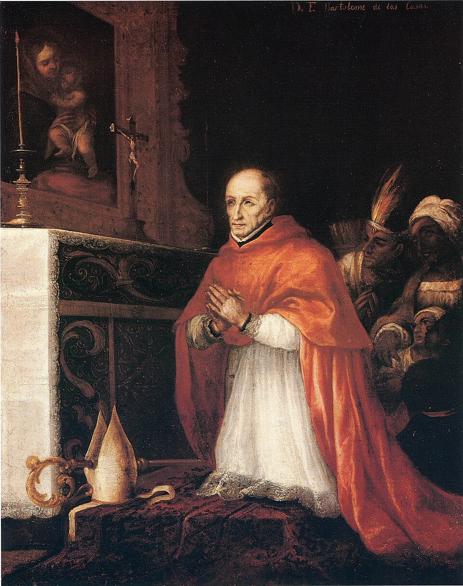

# São Turíbio de Mongrovejo, 23 de março

Turíbio nasceu na ilha de Maiorca, Espanha, em 1538. Como leigo ainda, o rei Filipe II da Espanha o nomeou presidente do Tribunal da Inquisição de Granada. Embora leigo, por causa de seus bons serviços ao Estado e à Religião o rei o apresentou como candidato a arcebispo de Lima, no Peru. Relutou, mas aceitou. Desembarcou em Lima e logo pôs-se a visitar o imenso território peruano. Organizou paróquias, reuniu sínodos e combateu problemas sociais e espirituais. Temperou a crueldade dos colonizadores com bondade, justiça, oração, sacrifícios. Longe 440 quilômetros de Lima, em visita pastoral, caiu gravemente enfermo. Percebendo que era o fim, desfez-se de tudo o que trazia em favor dos pobres e no dia 23 de março de 1606 faleceu. Foi canonizado em 1726 como exemplo de bispo que tentou plantar a Igreja nas novas terras da América, ao lado da caridade e da justiça, coisas ausentes nos colonizadores.
