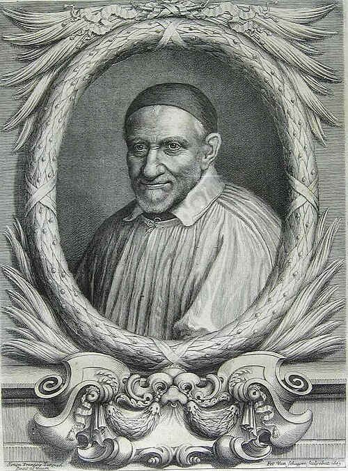

# São Vicente de Paulo, 27 de setembro

Vicente nasceu em 1581, nas vizinhanças de Paris, França. Fez-se sacerdote e começou a trabalhar numa paróquia difícil da periferia. Aliás, era uma fase difícil do tempo: crianças abandonadas, miséria material, prostituição generalizada, luta de classes sociais, ignorância religiosa, esfriamento da piedade. Tudo isso era consequência das guerras frequentes. Vicente tinha ouvido aos ricos e os levava a auxiliar os pobres.

Começou a evangelizar os camponeses, reformou o clero na piedade, disciplina e estudos, instituiu obras assistenciais, deu impulso à pregação, instituiu a Congregação da Missão (Padres Lazaristas) e, com Santa Luísa de Marillac, fundou as Filhas da Caridade (Irmãs Vicentinas). Criou seminários e desenvolveu as missões. Morreu a 27 de setembro de 1660 e foi canonizado como o grande reformador da sociedade e da Igreja da França do século XVII. As Conferências Vicentinas de hoje nascem de seu espírito.

### Oração a São Vicente de Paulo

São Vicente de Paulo, padroeiro de todas as associações de caridade e pai de todos os infelizes, vede a multidão de males pelos quais está passando a humanidade de nosso tempo! Alcançai do Senhor socorro aos pobres, alívio aos enfermos, consolação aos aflitos, proteção aos desamparados, abertura de espírito aos ricos, conversão dos pecadores, zelo aos sacerdotes e paz à Igreja. Pela vossa intercessão e seguindo o vosso exemplo de total desapego das coisas deste mundo e de amor aos homens, saibamos transformar a nossa sociedade, e dar condições para que as pessoas cheguem ao conhecimento e ao amor a Deus e se preparem para a eternidade. Amém.
