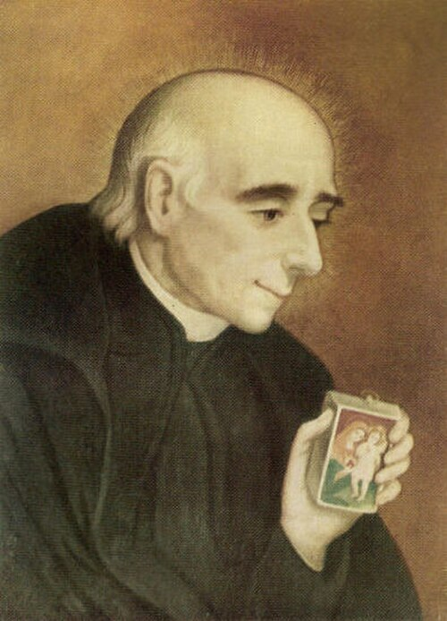

# São Vicente Pallotti, 22 de janeiro

Embora do século XIX, Vicente Pallotti foi um homem com a dinâmica interior de séculos futuros. É lançar em movimento os critérios fixos da Igreja. Exigiu o compromisso do homem leigo. De sua colaboração esperava novos impulsos. Com entusiasmo, Vicente trabalhou para a fé e o amor. Seu ideal era Jesus Cristo, o Homem-Deus entre os homens, seus irmãos.

Sua vida. Nascido a 21 de abril de 1795, em Roma, foi ordenado sacerdote a 16 de maio de 1818. Seu ideal era um movimento apostólico universal de todos os batizados da Igreja. E fundou uma comunidade de sacerdotes e leigos, a Sociedade do Apostolado Católico, em 1835. Morreu em Roma a 22 de janeiro de 1850. Foi canonizado por João XXIII a 20 de janeiro de 1963, durante o Concílio Vaticano II.

Seu programa de vida: pão e comida para os famintos, vestimenta para os nus, bebida para os sedentos, força para os fracos, colchão para os exaustos, remédio e saúde para os doentes, os aleijados, os coxos, os surdos e mudos, luz para os cegos do corpo e do espírito, vida para os que estão mortos para a vida da graça.
