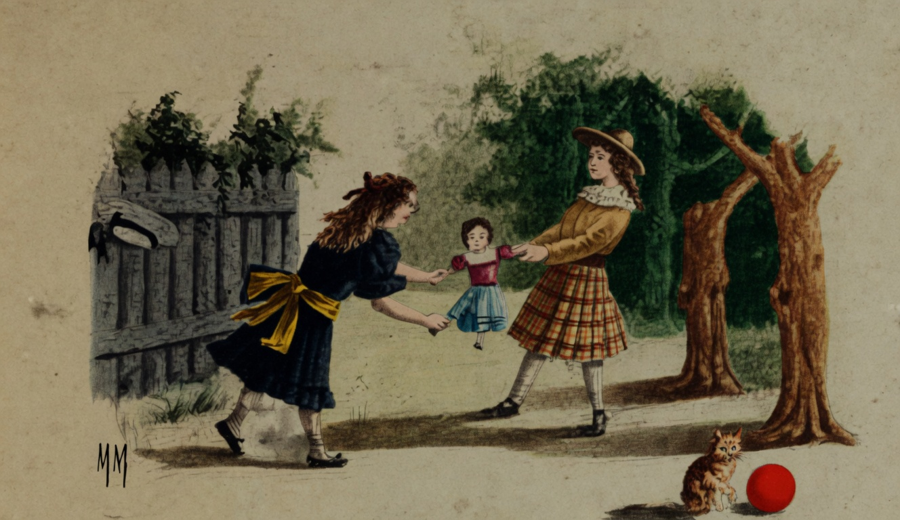

# A Boneca

{alt="Duas meninas puxam uma boneca no jardim; gato sob a árvore à direita. Litografia da edição de 1904. Iniciais HM à esquerda."}

| Deixando a bola e a petéca,
| Com que inda ha pouco brincavam,
| Por causa de uma boneca,
| Duas meninas brigavam.

| Dizia a primeira : « É minha ! »
| — « É minha! » a outra gritava ;
| E nenhuma se continha,
| Nem a boneca largava.

| Quem mais soffria (coitada!)
| Era a boneca. Já tinha
| Toda a roupa estraçalhada,
| E amarrotada a carinha.

| Tanto puxavam por ella,
| Que a pobre rasgou-se ao meio,
| Perdendo a estôpa amarella
| Que lhe formava o recheio.

| E, ao fim de tanta fadiga,
| Voltando á bola e á petéca,
| Ambas, por causa da briga,
| Ficaram sem a boneca...
