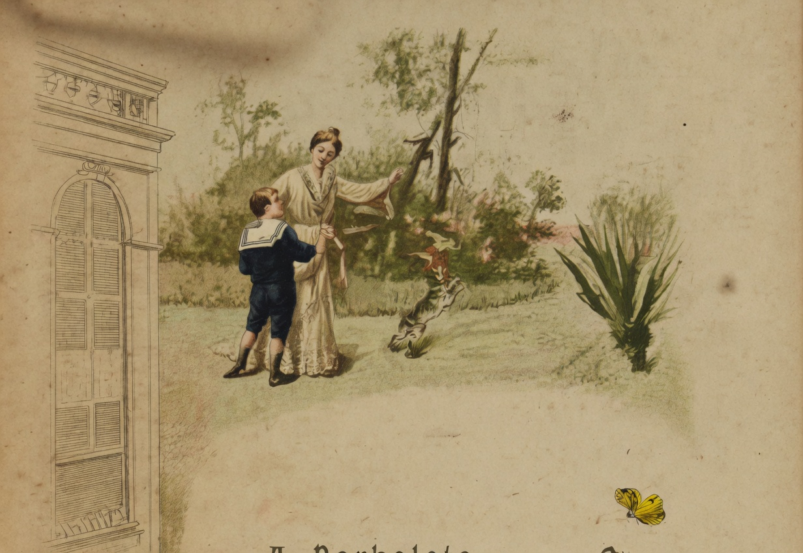

# A Borboleta

{alt="Jardim com portão à esquerda; mulher e criança no gramado; borboleta à direita. Litografia da edição de 1904. Iniciais HM no portão."}

| Trazendo uma borboleta,
| Volta Alfredo para casa.
| Como é linda ! é toda preta,
| Com listas douradas na aza.

| Tonta, nas mãos da creança,
| Batendo as azas, n'um susto,
| Quer fugir, porfia, cança,
| E treme, e respira a custo.

| Contente, o menino grita :
| « É a primeira que apanho,
| « Mamãe ! vê como é bonita !
| « Que côres e que tamanho !

| « Como voava no matto !
| « Vou sem demora pregal-a
| « Por baixo do meu retrato,
| « N'uma parede da sala ».

| Mas a mamãe, com carinho,
| Lhe diz : « Que mal te fazia,
| « Meu filho, esse animalzinho,
| « Que livre e alegre vivia?

| « Solta essa pobre coitada !
| « Larga-lhe as azas, Alfredo !
| « Vê como treme assustada...
| « Vê como treme de medo...

| « Para sem pena espetal-a
| « N'uma parede, menino,
| « É necessario matal-a :
| « Queres ser um assassino ? »

| Pensa Alfredo... E, de repente,
| Solta a borboleta... E ella
| Abre as azas livremente,
| E foge pela janella.

| « Assim, meu filho ! perdeste
| « A borboleta dourada,
| « Porém na estima cresceste
| « De tua mãe adorada...

| « Que cada um cumpra a sorte
| « Das mãos de Deus recebida :
| « Pois só pode dar a Morte
| « Aquelle que dá a Vida. »
