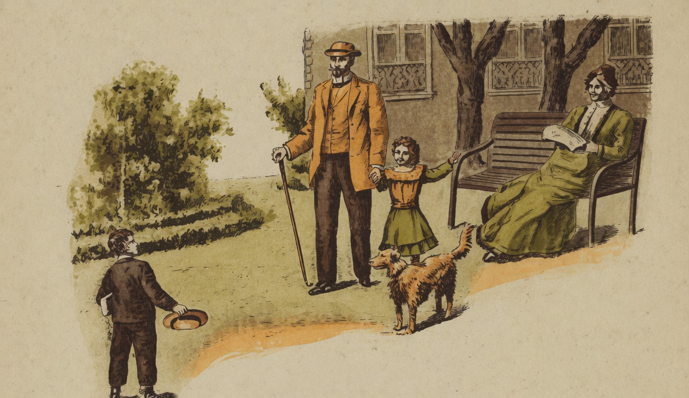

# A Caza

{alt="Gravura de cabeçalho do poema A Caza. Litografia da edição de 1904."}

| Vê como as aves teem, debaixo d'aza,
| O filho implume, no calor do ninho!...
| Deves amar, creança, a tua casa !
| Ama o calor do maternal carinho !

| Dentro da casa em que nasceste és tudo.
| Como tudo é feliz, no fim do dia,
| Quando voltas das aulas e do estudo !
| Volta, quando tu voltas, a alegria!

| Aqui deves entrar como n'um templo,
| Com a alma pura, e o coração sem susto :
| Aqui recebes da Virtude o exemplo,
| Aqui aprendes a ser meigo e justo.

| Ama esta casa ! Pede a Deus que a guarde,
| Pede a Deus que a proteja eternamente!
| Porque talvez, em lagrimas, mais tarde,
| Te vejas, triste, d'esta casa ausente...

| E, já homem, já velho e fatigado,
| Te lembrarás da casa que perdeste,
| E has-de-chorar, lembrando o teu passado...
| — Ama, creança, a casa em que nasceste!
