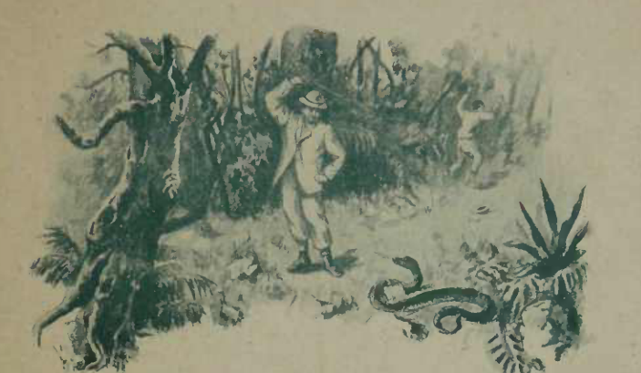

# A Coragem

{alt="Gravura de cabeçalho do poema A Coragem. Litografia da edição de 1904."}

| Não sejas nunca medroso !
| Fraco embora, tem coragem!
| Para fazer a viagem
| Da vida, sem hesitar,
| É preciso, de alma forte,
| Sem ostentar valentia,
| Dominar a covardia,
| Para o perigo enfrentar.

| O medo é proprio do perfido,
| Do peccador, do malvado :
| Quem não se entrega ao peccado
| Não receia a punição.

| Não tem medo quem caminha
| Com a consciencia tranquilla,
| Quem o inimigo aniquila
| Com a força da razão!

| Não abuses da bravura;
| Não affrontes o inimigo ;
| Não procures o perigo;
| Prega o amor ! e prega a paz !

| Mas, se isso fôr impossivel,
| Não fujas! cae batalhando !
| E, se morreres luctando,
| Morre! feliz morrerás.
