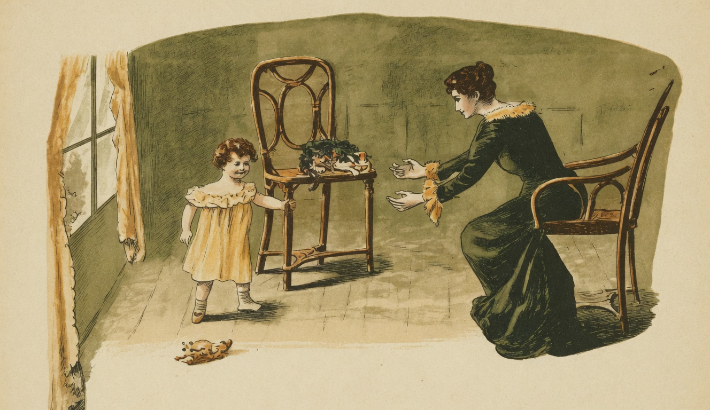

# A Infancia

{alt="Gravura de cabeçalho do poema A Infancia. Litografia da edição de 1904."}

| O berço em que, adormecido,
| Repousa um recem-nascido,
| Sob o cortinado e o véo,
| Parece que representa,
| Para a mamãe que o acalenta,
| Um pedacinho do céo.

| Que jubilo, quando, um dia,
| A creança principia,
| Aos tombos, a engatinhar...
| Quando, agarrada ás cadeiras,
| Agita-se horas inteiras
| Não sabendo caminhar!

| Depois, a andar já começa,
| E pelos moveis tropeça,
| Quer correr, vacilla, cáe...
| Depois, a bocca entreabrindo,
| Vae pouco a pouco sorrindo,
| Dizendo : mamãe... papae...

| Vae crescendo. Forte e bella,
| Corre a casa, tagarella,
| Tudo escuta, tudo vê...
| Fica esperta e intelligente...
| E dão-lhe, então, de presente
| Uma carta de A. B. C...
