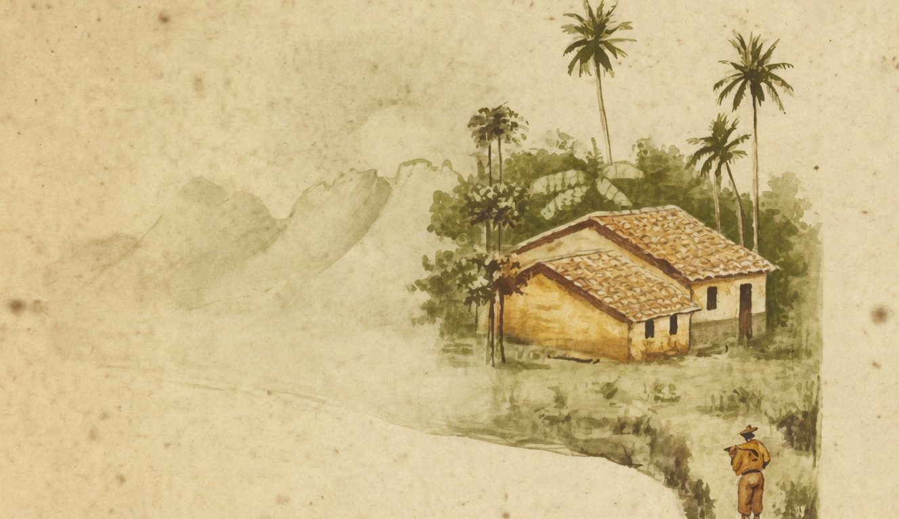

# A madrugada

{alt="Gravura de cabeçalho do poema A madrugada. Litografia da edição de 1904."}

| Os passaros, que dormiam
| Nas arvores orvalhadas,
| Já a alvorada annunciam
| No silencio das estradas.

| As estrellas, apagando
| A luz com que resplandecem,
| Vão timidas vacillando
| Até que desapparecem.

| D'este lado do horizonte,
| Numa nevoa luminosa,
| O céo, por cima do monte,
| Fica todo côr de rosa;

| D'ahi a pouco, inflammado
| N'uma claridade intensa,
| Se desdobra avermelhado,
| Como uma fogueira immensa.

| Os gallos, batendo as azas,
| Madrugadores, já cantam;
| Já ha barulho nas casas,
| Já os homens se levantam.

| O lavrador pega a enxada,
| Mugem os bois á porfia;
| — É a hora da madrugada :
| Saudae o nascer do dia!
