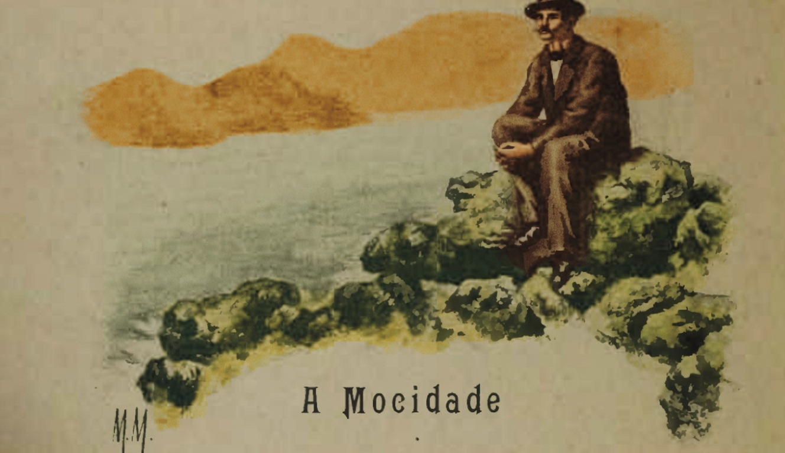

# A mocidade

{alt="Gravura de cabeçalho do poema A mocidade. Litografia da edição de 1904."}

| A Mocidade é como a Primavera!
| A alma, cheia de flores, resplandece,
| Crê no Bem, ama a vida, sonha e espera,
| E a desventura facilmente esquece.

| E' a idade da força e da belleza :
| Olha o futuro, e inda não tem passado:
| E, encarando de frente a Natureza,
| Não tem receio do trabalho ousado.

| Ama a vigilia, aborrecendo o somno;
| Tem projectos de gloria, ama a Chimera;
| E ainda não dá fructos como o outono,
| Pois só dá flores como a primavera!
