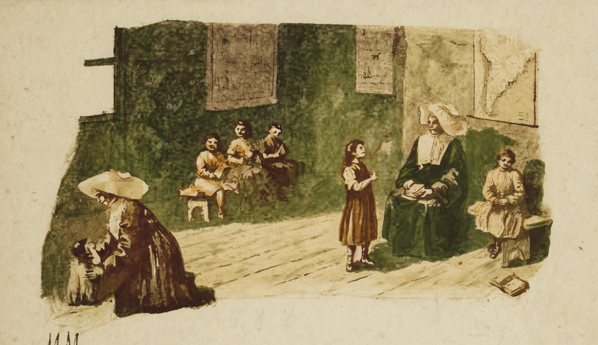

# A Modestia

{alt="Gravura de cabeçalho do poema A Modestia. Litografia da edição de 1904."}

| Se a todos os condiscipulos
| Te julgas superior,
| Esconde o merito, e calla-te
| Sem ostentar teu valor.

| Valem mais que a intelligencia,
| A constancia e a applicação :
| Sê modesto ! estuda, applica-te,
| E foge da ostentação!

| Mais vale o merito proprio
| Sentir, guardar e occultar :
| Porque o verdadeiro merito
| Não gosta de se mostrar.
