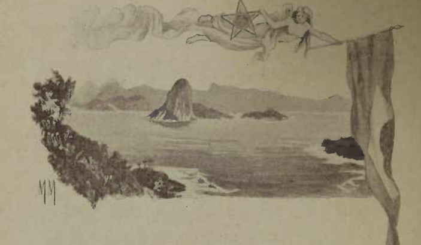

# A Patria

{alt="Gravura de cabeçalho do poema A Patria. Litografia da edição de 1904."}

| Ama, com fé e orgulho, a terra em que nasceste!
| Creança ! não verás nenhum paiz como este !
| Olha que céo! que mar ! que rios ! que floresta!
| A Natureza, aqui, perpetuamente em festa,
| É um seio de mãe a transbordar carinhos.

| Vê que vida ha no chão! vê que vida ha nos ninhos,
| Que se balançam no ar, entre os ramos inquietos!
| Vê que luz, que calor, que multidão de insectos!
| Vê que grande extensão de mattas, onde impera
| Fecunda e luminosa, a eterna primavera!

| Boa terra! jamais negou a quem trabalha
| O pão que mata a fome, o tecto que agazalha...
| Quem com o seu suor a fecunda e humedece,
| Vê pago o seu esforço, e é feliz, e enriquece!

| Creança! não verás paiz nenhum como este :
| Imita na grandeza a terra em que nasceste!
