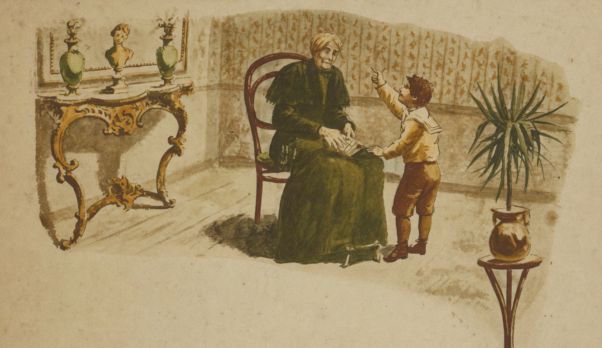

# A Velhice

{alt="Gravura de cabeçalho do poema A Velhice. Litografia da edição de 1904."}

O Neto :

| Vovó, porque não tem dentes?
| Porque anda rezando só,
| E treme, como os doentes
| Quando têm febre, vovó?

| Porque é branco o seu cabello?
| Porque se apoia a um bordão?
| Vovó, porque, como o gelo,
| É tão fria a sua mão?

| Porque é tão triste o seu rosto?
| Tão tremula a sua voz?
| Vovó, qual é seu desgosto?
| Porque não ri como nós?

A Avó :

| Meu neto, que és meu encanto,
| Tu acabas de nascer...
| E eu, tenho vivido tanto
| Que estou farta de viver!

| Os annos, que vão passando,
| Vão nos matando sem dó :
| Só tu consegues, fallando,
| Dar-me alegria, tu só!

| O teu sorriso, creança,
| Cae sobre os martyrios meus,
| Como um clarão de esperança,
| Como uma benção de Deus!
