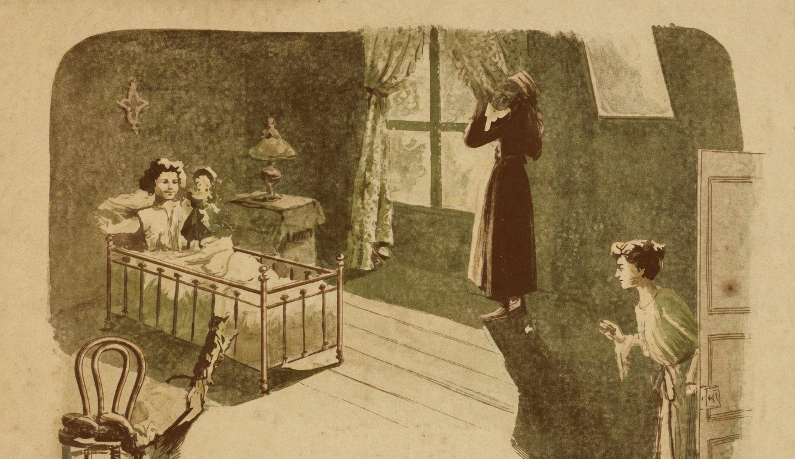

# Anno Bom

{alt="Gravura de cabeçalho do poema Anno Bom. Litografia da edição de 1904."}

| Anno-Bom. De madrugada,
| Bebê desperta, e, assustada,
| Avista um vulto na cama.
| Que será? Que medo! E, tonta,
| Eis que Bebê se amedronta,
| Chora, grita, chama, chama...

| Mas, quando se abre a cortina,
| Quando o quarto se illumina,
| Bebê, de pasmo ferida,
| Vê que o medo não é justo :
| Pois a causa de seu susto
| E' uma boneca vestida.

| Que linda! é gorda e corada,
| Tem cabelleira dourada
| E olhos côr do firmamento...
| Põe-na no collo a creança,
| E de olhal-a não se cança,
| Beijando-a a todo o momento.

| Nisto a mamãe apparece.
| Como Bebê lhe agradece,
| Com beijos, risos e abraços!
| — Porém, logo, de repente,
| Diz á mamãe, tristemente,
| Prendendo-a muito nos braços :

| « Mamãe! como sou ingrata!
| « Com tantos mimos me trata,
| « Tão boa, tão dedicada!
| « Dá-me vestidos e fitas,
| « Dá-me bonecas bonitas,
| « E eu, mamãe, não lhe dou nada! »

| « Tolinha! (a mãe diz, num beijo)
| « As festas que eu mais desejo,
| « O minha filha, são estas :
| « A tua meiga bondade
| « E a tua felicidade...
| « Não quero melhores festas! »
