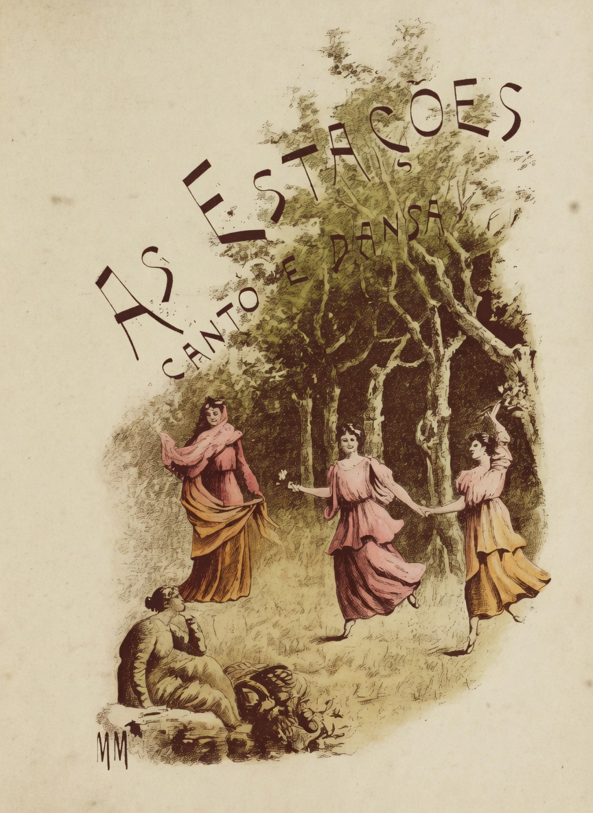
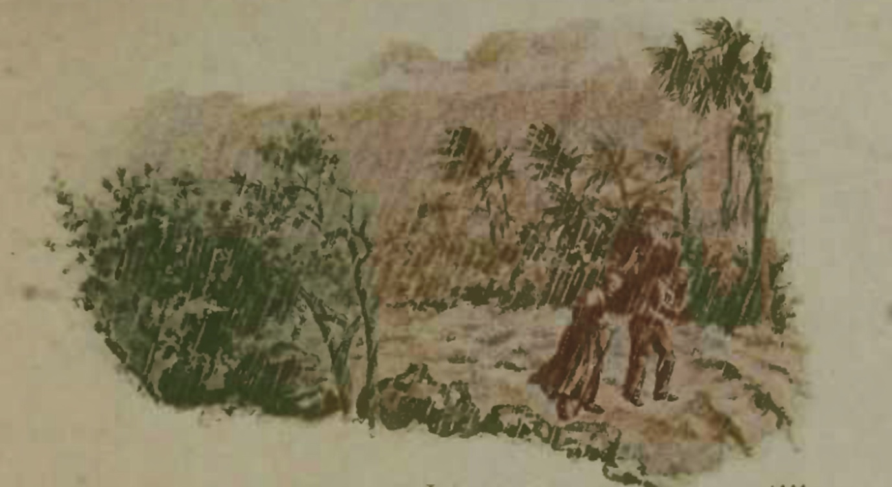
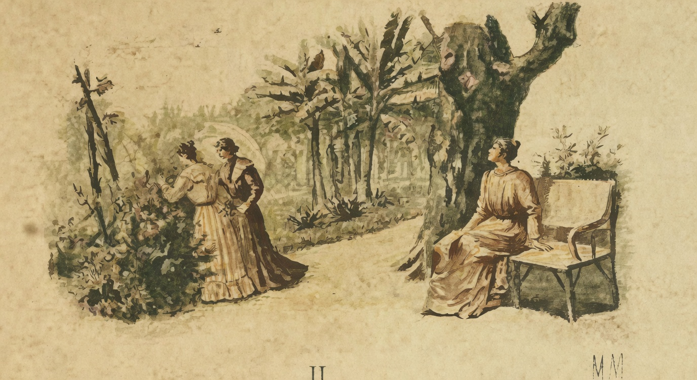
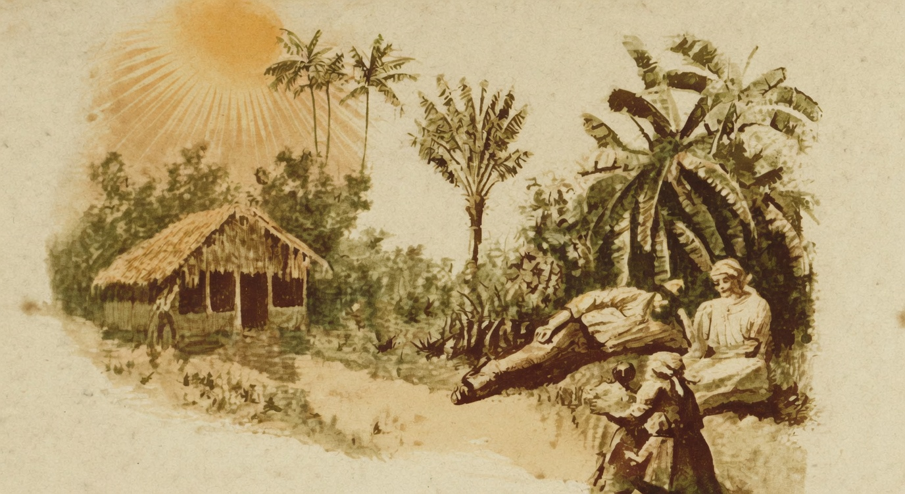
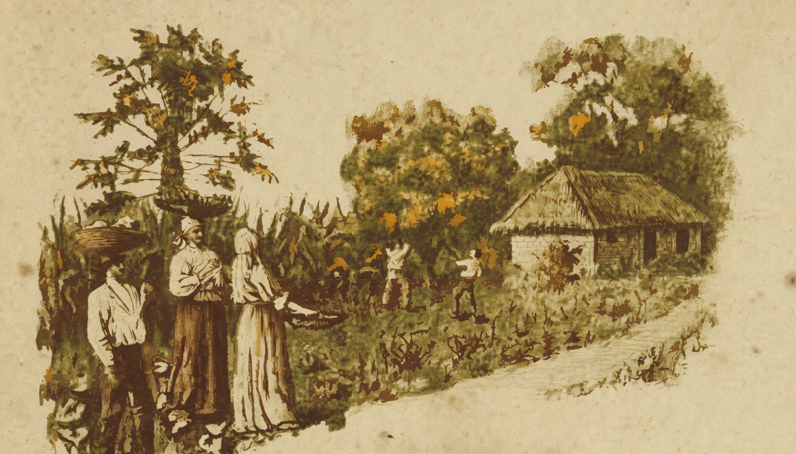

# As Estações

{alt="Quatro figuras femininas dançam sob árvores; título «As Estações — Canto e Dansa» em arco. Litografia de página inteira da edição de 1904. Iniciais HM embaixo à esquerda."}

## I — O Inverno

{alt="Paisagem de inverno com palmeiras e vegetação baixa. Litografia da edição de 1904. Iniciais HM à direita."}

Côro das quatro estações :

| Cantemos, irmãs, dansemos !
| Espantemos a tristeza !
| E dansando, celebremos
| A gloria da Natureza !

O Inverno :

| Sou a estação do frio ;
| O céo está sombrio,
| E o sol não tem calor.
| Que vento nos caminhos!
| Trago a tristeza aos ninhos,
| E trago a morte á flôr.

| Ha nevoa no horizonte,
| No campo e sobre o monte,
| No valle e sobre o mar.
| Os passaros se encolhem,
| Os velhos se recolhem
| Á casa, a tiritar.

| Porém fóra a tristeza !
| Em breve, a Natureza
| Dá flores ao jardim :
| Abramos a janella !
| Outra estação mais bella
| Já vem depois de mim.

Côro das quatro estações :

| Cantemos, irmãs, dansemos !
| Espantemos a tristeza !
| E, dansando, celebremos
| A gloria da Natureza.

## II — A Primavera

{alt="Jardim: duas mulheres à esquerda, outra sentada à direita sob árvore. Litografia da edição de 1904. Iniciais HM à direita."}

Côro das quatro estações :

| Cantemos ! Fora a tristeza !
| Saudemos a luz do dia!
| Saudemos a Natureza!
| Já nos voltou a alegria!

A Primavera :

| Eu sou a Primavera!
| Está limpa a atmosphera,
| E o sol brilha sem véo!
| Todos os passarinhos
| Já sáem dos seus ninhos,
| Voando pelo céo.

| Ha risos na cascata,
| Nos lagos e na matta,
| Na serra e no vergel:
| Andam os beija-flores
| Pousando sobre as flores,
| Sugando-lhes o mel.

| Dou vida aos verdes ramos,
| Dou voz aos gaturamos
| E paz aos corações;
| Cubro as paredes de hera;
| Eu sou a Primavera,
| A flôr das estações!

Côro das quatro estações :

| Cantemos! Fóra a tristeza!
| Saudemos a luz do dia!
| Saudemos a Natureza !
| Já nos voltou a alegria !

## III — O Verão

{alt="Casa de palha à esquerda, palmeiras, figura sentada à direita. Litografia da edição de 1904. Iniciais HM à direita."}

Côro das quatro estações :

| Que calor, irmãs! Cantemos
| Como ardem as ribanceiras !
| Cantemos, irmãs, dansemos,
| Á sombra d'estas mangueiras.

O Verão :

| Sou o Verão ardente,
| Que, vivo e resplendente,
| Acaba de nascer;
| Nas mattas abrazadas,
| O fogo das queimadas
| Começa a se accender.

| Tudo de luz se cobre...
| Dou alegria ao pobre;
| Na roça a plantação
| Expande-se, viceja,
| Com a vinda bemfazeja
| Do provido Verão.

| Sou o Verão fecundo!
| Nasce no céo profundo
| Mais rútilo o arrebol...
| A vida se levanta...
| A Natureza canta...
| Sou a estação do Sol!

Côro das quatro estações :

| Que calor, irmãs! Cantemos!
| Como ardem as ribanceiras!
| Cantemos, irmãs, dansemos,
| Á sombra d'estas mangueiras!

## IV — O Outono

{alt="Casal no campo à esquerda; casa ao fundo à direita. Litografia da edição de 1904. Iniciais HM à esquerda."}

Côro das quatro estações :

| Ha tantos fructos nos ramos,
| De tantas formas e côres!
| Irmãs! emquanto dansámos,
| Sahiram fructos das flores!

O Outono :

| Sou a sazão mais rica :
| A arvore fructifica
| Durante esta estação;
| No tempo da colheita,
| A gente satisfeita
| Saúda a Creação.

| Concede a Natureza
| O premio da riqueza
| Ao bom trabalhador,
| E enche, contente e ufana,
| De jubilo a choupana
| De cada lavrador.

| Vede como do galho,
| Molhado inda de orvalho,
| Maduro o fructo cáe...
| Interrompendo as dansas,
| Aproveitae, creanças!
| Os fructos apanhae!

Côro das quatro estações :

| Ha tantos fructos nos ramos,
| De tantas formas e côres!
| Irmãs! emquanto dansámos,
| Sahiram fructos das flores!
