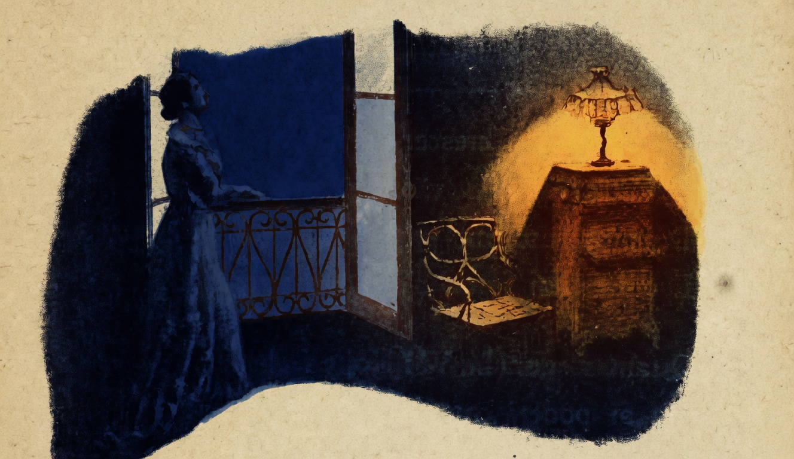

# As Estrellas

{alt="Mulher à janela, de perfil, olha o céu; à direita, quarto com cama e candeeiro. Litografia da edição de 1904. Iniciais HM à esquerda."}

| Quando a noite cair, fica á janella,
| E contempla o infinito firmamento !
| Vê que planicie fulgurante e bella !
| Vê que deslumbramento!
| Olha a primeira estrella que apparece
| Além, n'aquelle ponto do horizonte...
| Brilha, tremula e vivida... Parece
| Um pharol sobre o pincaro do monte.

| Com o crescer da treva,
| Quantas estrellas vão apparecendo !
| De momento em momento, uma se eleva,
| E outras em torno d'ella vão nascendo.

| Quantas agora !... Vê ! Noite fechada...
| Quem poderá contar tantas estrellas ?
| Toda a abobada está illuminada :
| E o olhar se perde, e cança-se de vel-as.

| Surgem novas estrellas imprevistas...
| Inda outras mais despontam...
| Mas, acima das ultimas que avistas,
| Ha milhões e milhões que não se contam...

| Baixa a fronte e medita:
| — Como, sendo tão grande na vaidade,
| Diante d'esta abobada infinita
| E' pequenina e fraca a humanidade !
