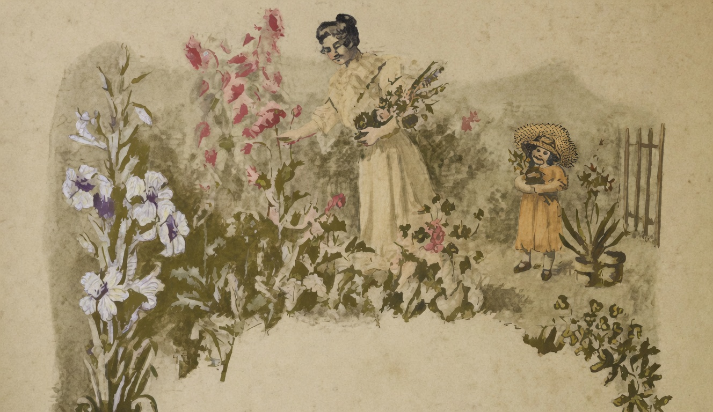

# As flores

{alt="Gravura de cabeçalho do poema As flores. Litografia da edição de 1904."}

| Deus ao mundo deu a guerra,
| A doença, a morte, as dores :
| Mas, para alegrar a terra,
| Basta haver-lhe dado as flores.

| Umas, creadas com arte,
| Outras, simples e modestas,
| Ha flores por toda a parte :
| Nos enterros e nas festas,

| Nos jardins, nos cemiterios,
| Nos paues e nos pomares;
| Sobre os jazigos funereos,
| Sobre os berços e os altares,

| Reina a flor! pois quiz a sorte
| Que a flor a tudo presida,
| E também enfeite a morte,
| Assim como enfeita a vida.

| Amae as flores, creanças!
| Sois irmans nos esplendores,
| Porque ha muitas semelhanças
| Entre as creanças e as flores...
