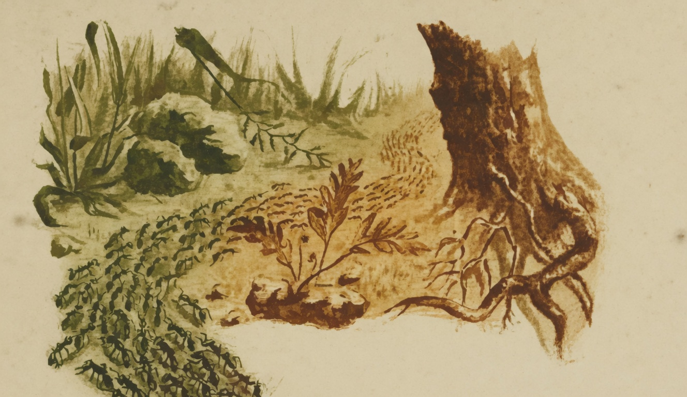

# As Formigas

{alt="Formigueiro entre pedras e um tronco; fila de formigas. Litografia da edição de 1904. Iniciais HM à esquerda."}

| Cautelosas e prudentes,
| O caminho atravessando,
| As formigas diligentes
| Vão andando, vão andando...

| Marcham em filas cerradas;
| Não se separam ; espiam
| De um lado e de outro, assustadas,
| E das pedras se desviam.

| Entre os calháus vão abrindo
| Caminho estreito e seguro,
| Aqui, ladeiras subindo,
| Acolá, galgando um muro.

| Esta carrega a migalha;
| Outra, com passo discreto,
| Leva um pedaço de palha;
| Outra, uma pata de insecto.

| Carrega cada formiga
| Aquillo que achou na estrada;
| E nenhuma se fatiga,
| Nenhuma pára cançada.

| Vede! emquanto negligentes
| 'Stão as cigarras cantando,
| Vão as formigas prudentes
| Trabalhando e armazenando.

| Também quando chega o frio,
| E todo o fructo consome,
| A formiga, que no estio
| Trabalha, não soffre fome.

| Recordae-vos todo o dia
| Das lições da Natureza :
| O trabalho e a economia
| São as bases da riqueza.
