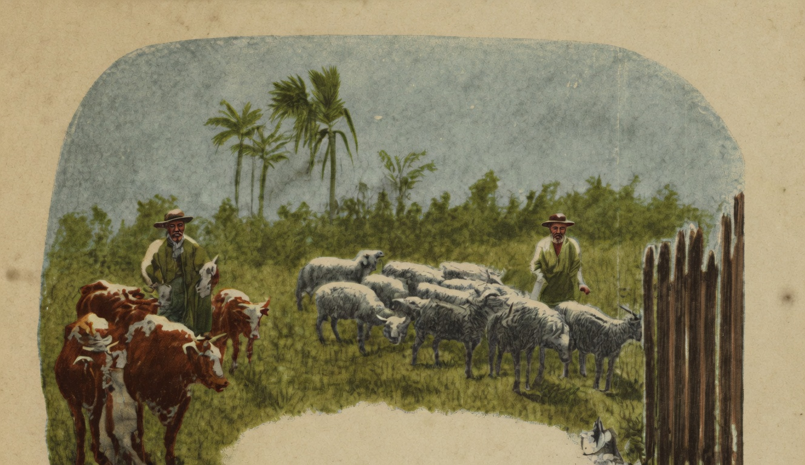

# Ave-Maria

{alt="Gravura de cabeçalho do poema Ave-Maria. Litografia da edição de 1904."}

| Meu filho ! termina o dia...
| A primeira estrella brilha...
| Procura a tua cartilha,
| E reza a Ave Maria!

| O gado volta aos curraes...
| O sino canta na egreja...
| Pede a Deus que te proteja
| E que dê vida a teus pães!

| Ave Maria!... Ajoelhado,
| Pede a Deus que, generoso,
| Te faça justo e bondoso,
| Filho bom, e homem honrado ;

| Que teus pães conserve aqui
| Para que possas, um dia,
| Pagar-lhes em alegria
| O que soffreram por ti.

| Reza, e procura o teu leito,
| Para adormecer contente;
| Dormirás tranquillamente,
| Se disseres satisfeito :

| « Hoje, pratiquei o bem :
| Não tive um dia vazio,
| Trabalhei, não fui vadio,
| E não fiz mal a ninguém. »
