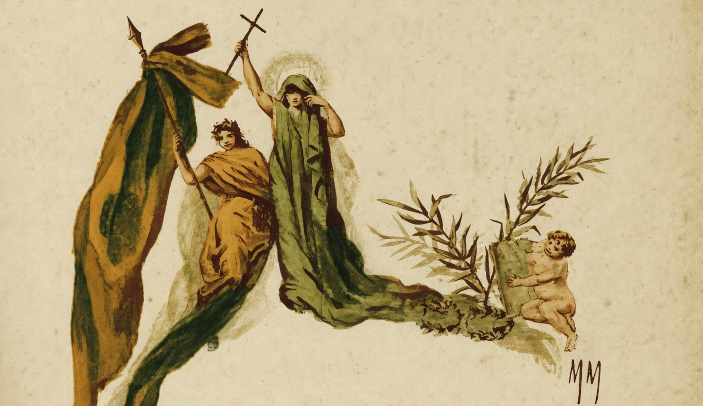

# Crédo

{alt="Gravura de cabeçalho do poema Crédo. Litografia da edição de 1904."}

| Crê no Dever e na Virtude!
| E' um combate insano e rude
| A vida, em que tu vaes entrar.
| Mas, sendo bom, com esse escudo,
| Serás feliz, vencerás tudo :
| Quem nasce, vem para luctar.

| E crê na Patria! Inda que a vejas,
| Preza de ideias malfazejas,
| Em qualquer epocha, infeliz,
| — Não a abandones ! porque a Gloria
| Inda has-de ver numa victoria
| Mudar cada uma cicatriz.

| E crê no Bem ! Inda que, um dia,
| No desespero e na agonia,
| Mais desgraçado que ninguém,
| Te vejas pobre e injuriado,
| De toda a gente despresado,
| — Perdoa o mal! E crê no Bem !

| E crê no Amor ! Se póde a guerra
| Cobrir de sangue toda a terra,
| Levando a tudo a assolação,
| — Mais póde, limpida e sublime,
| Caindo sobre um grande crime
| Uma palavra de perdão!
