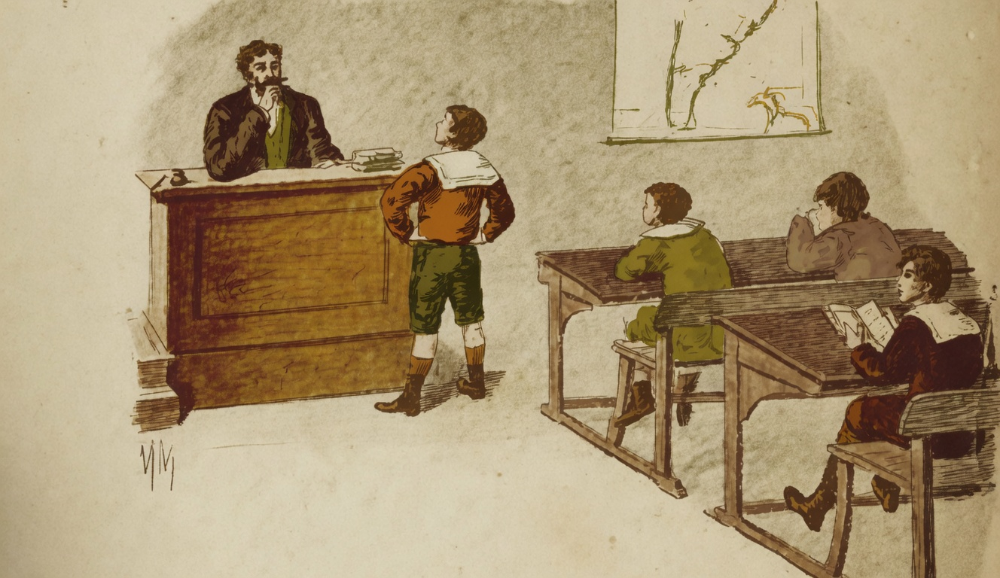

# Deus

{alt="Gravura de cabeçalho do poema Deus. Litografia da edição de 1904."}

| Para experimentar Octavio, o mestre
| Diz : « Já que tudo sabe, venha cá!
| « Diga em que ponto da extensão terrestre
| « Ou da extensão celeste Deus está! »

| Por um momento apenas, fica mudo
| Octavio, e logo esta resposta dá :
| « Eu, senhor mestre, lhe daria tudo,
| Se me dissesse onde é que elle não está!»
