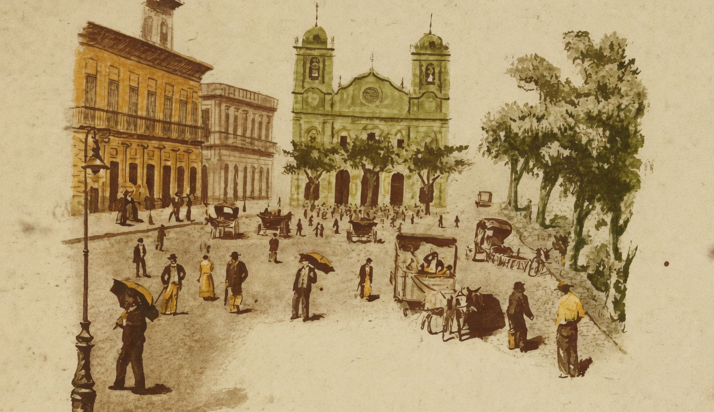

# Domingo

{alt="Praça com igreja de duas torres, gente e barracas. Litografia da edição de 1904."}

| Domingo... Os sinos repicam
| Na egreja, constantemente,
| E todas as ruas ficam
| Alegres, cheias de gente.

| Todo um dia de ventura...
| Como o domingo seduz !
| O homem, cançado, procura
| Ter paz, ter ar, e ter luz.

| Paradas e sem trabalho,
| Dormem na roça as enxadas ;
| Dormem a bigorna e o malho
| Nas officinas fechadas.

| Também, meninos cançados,
| Os vossos livros deixae !
| Deixae lições e dictados !
| Dormi! Sorride ! Cantae !

| Fechem-se as aulas ! E o bando
| Ruidoso das creancinhas
| Livre se espalhe, voando,
| Como um bando de andorinhas !

| Deus, quando o mundo fazia,
| Sete dias trabalhou,
| E ao fim do sétimo dia
| Do trabalho descançou...
