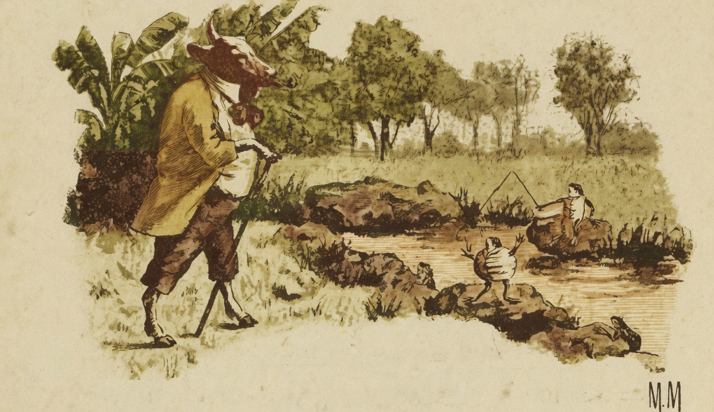

# Fabulas

{alt="Gravura de cabeçalho das Fábulas. Litografia da edição de 1904."}

## A Rã e o Touro

(FABULA DE ESOPO)

| Pastava um touro enorme e forte, á beira d'agua.
| Vendo-o tão grande, a rã, cheia de inveja e magoa,
| Disse : « Por que razão hei-de-ser tão pequena,
| Que aos outros animaes só faça nojo e pena?
| Vamos ! quero ser grande ! incharei tanto, tanto,
| Que, immensa, causarei ás outras rãs espanto !»

| Poz-se a comer e a inchar. E ás rãs interrogava :
| «Já vos pareço um touro ?» E inchava, inchava, inchava!...
| Mas em vão! Tanto inchou que, num tremendo estouro,
| Rebentou e morreu, sem ficar como o touro.

| Essa tola ambição da rã que quer ser forte
| Muitos homens conduz ao desespero e á morte.
| Gente pobre, invejando a gente que é mais rica,
| Quer como ella gastar, e inda mais pobre fica :
| — Gasta tudo que tem, o que não tem consome,
| E, por querer ter mais, vem a morrer de fome.

## O Soldado e a Trombeta

(FABULA DE ESOPO)

| Um velho soldado
| Um dia por terra
| A espada atirou;
| Da guerra cançado,
| Com nojo da guerra,
| As armas quebrou.

| Entre ellas estava
| Trombeta esquecida:
| Era ella que no ar
| Os toques soltava,
| E á lucta renhida
| Tocava a avançar.

| E disse : « Meu dono,
| E' justo que a espada
| Tu quebres assim !
| Mas que, no abandono,
| Fique eu socegada !
| Não quebres a mim!

| Cantei tão somente...
| Não sejas ingrato
| Commigo também!
| Eu sou innocente :
| Não piso, não mato,
| Não firo a ninguém...

| Nas horas da lucta
| Alegre ficavas,
| Ouvindo o meu som.
| Attende-me! escuta!
| Se então me estimavas,
| Agora sê bom! »

| E o velho guerreiro
| Lhe disse : « Maldita!
| Prepara-te! sús!
| Teu som zombeteiro
| As gentes excita,
| A guerra as conduz! »

| Terrivel, irado,
| Jogou-a por terra,
| Sem dó a quebrou...
| E o velho soldado,
| Cançado da guerra
| Por fim repousou.

## O Leão e o Camondongo

(FABULA DE ESOPO)

| Um camondongo humilde e pobre
| Foi um dia cair nas garras de um leão.
| E esse animal possante e nobre
| Não o matou por compaixão.

| Ora, tempos depois, passeando descuidoso,
| Numa armadilha o leão caiu:
| Urrou de raiva e dôr, estorceu-se furioso....
| Com todo o seu vigor as cordas não partiu.

| Então, o mesmo fraco e pequenino rato
| Chegou : viu a afflicção do robusto animal,
| E, não querendo ser ingrato,
| Tanto as cordas roeu, que as partiu afinal...

| Vede bem: um favor, feito aos que estão soffrendo,
| Póde sempre trazer em paga outro favor.
| E o mais forte de nós, do orgulho se esquecendo,
| Deve os fracos tratar com caridade e amor.

## O Lobo e o Cão

(FABULA DE ESOPO)

| Encontraram-se na estrada
| Um cão e um lobo. E este disse :
| « Que sorte amaldiçoada!
| Feliz seria, se um dia
| Como te vejo me visse.

| Andas gordo e bem tratado.
| Vendes saúde e alegria:
| Ando triste e arrepiado,
| Sem ter onde cair morto!
| Gozas de todo o conforto
| E estás cada vez mais moço;

| E eu, para matar a fome,
| Nem acho ás vezes um osso!
| Esta vida me consome...
| Dize-me tu, companheiro :
| Onde achas tanto dinheiro? »

| Disse-lhe o cão :
| « Lobo amigo!
| Serás feliz, se quizeres
| Deixar tudo e vir commigo;
| Vives assim porque queres...

| Terás comida á vontade,
| Terás affecto e carinho,
| Mimos e felicidade,
| Na boa casa em que vivo! »

| Foram-se os dois. Em caminho,
| Disse o lobo, interessado :
| « Que é isto? Por que motivo
| Tens o pescoço esfolado?»

| — « É que, ás vezes, amarrado
| Me deixam durante o dia...»
| « Amarrado ? Adeus, amigo!
| (Disse o lobo) Não te sigo!

| Muito bem me parecia
| Que era demais a riqueza...
| Adeus! inveja não sinto :
| Quero viver como vivo!
| Deixa-me, com a pobreza!
| — Antes livre, mas faminto,
| Do que gordo, mas captivo! »
