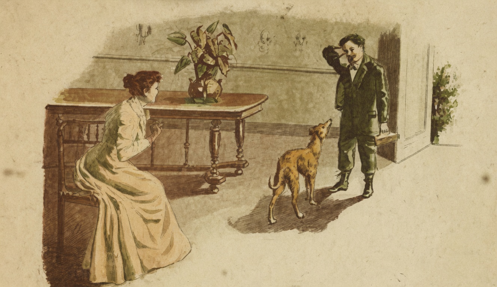

# Justiça

{alt="Gravura de cabeçalho do poema Justiça. Litografia da edição de 1904."}

| Chega á casa, chorando, o Oscar. Abraça
| Em prantos a Mamãe.
| « Que foi, meu filho ? »
| — « Succedeu-me, Mamãe, uma desgraça!
| « Outros, no meu collegio, com mais brilho,
| « Tiveram premios, livros e medalhas...
| « Só eu não tive nada ! »

| — « Mas porque não trabalhas ?
| « Porque é que, a uma existencia dedicada
| « Ao trabalho e ao estudo,
| « Preferes os passeios ociosos?
| « Os outros, filho, mais estudiosos,
| « Pelas suas lições despresam tudo...
| « Pois querias então que, vadiando,
| « Os outros humilhasses,
| « E que, os melhores premios conquistando,
| « Mais que os outros brilhasses ?
| « Para outra vez, ao teu prazer prefere
| « O estudo! e o premio alcançarás sem custo :
| « E aprende : mesmo quando isso te fere,
| « E' preciso ser justo! »
